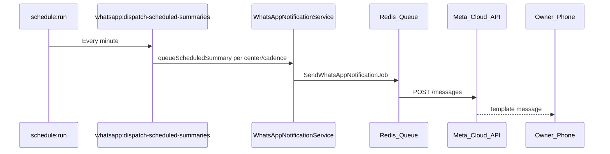

# WhatsApp Cloud API

[← Documentation hub](../README.md) | ADR [0007](../architecture/decisions/0007-whatsapp.md)

Meta WhatsApp Cloud API integration notes for Cash Flow Summary.

---

## Configuration

Stored in application settings (Owner admin UI), not committed to Git.

### Outbound messaging (required to send)

| Setting | Required | Notes |
|---------|----------|-------|
| Owner recipient phone (E.164) | Yes | Where alerts are delivered |
| Phone number ID | Yes | From Meta app / test number |
| Permanent access token | Yes | Encrypted at rest |

These three fields (plus phone number ID and access token from Meta) are **enough to send WhatsApp messages** during local and staging tests.

### Inbound webhooks (production; optional for testing)

| Setting | Required | Notes |
|---------|----------|-------|
| Webhook verify token | **Optional** | Shared secret for Meta GET verification challenge |

**Local / staging with Meta test number:** Meta’s WhatsApp **test number** flow provides phone number ID and access token but does **not** let you define a custom webhook verify token. Leave webhook verify token **empty** in Owner → WhatsApp Settings. Outbound sends work; delivery lifecycle updates are not expected.

**Production:** Configure the Meta webhook (URL + verify token) and enter the same verify token in WhatsApp Settings. The app uses it to validate `GET /api/webhooks/whatsapp` and to process inbound status events.

WhatsApp Business Account ID may be recorded for operator reference; it is not required for the send path implemented in this app.

---

## Configuration modes

| Mode | Settings | Outbound send | Delivery status updates |
|------|----------|---------------|-------------------------|
| **Testing** (Meta test number) | Owner phone, phone number ID, access token; webhook verify token **blank** | Yes | No — `sent` is the terminal status from the app’s perspective |
| **Production** | All outbound fields + webhook verify token + Meta webhook URL configured | Yes | Yes — `delivered`, `read`, `failed` updated from webhooks |

When webhook verify token is **not** configured, the application **must not** require it on save, **must not** register or enforce the webhook verification path, and **must ignore** delivered / read / failed status processing (Steps 97–98 implement this guard). When a verify token **is** present, webhook handling and delivery status updates behave normally.

---

## Outbound flow

Scheduled summaries (ADR [0012](../architecture/decisions/0012-whatsapp-scheduled-summaries.md)):



Per-import sends are **removed**. Imports no longer enqueue WhatsApp jobs.

---

## Idempotency

Before send, check `whatsapp_messages.idempotency_key` unique.

Scheduled summary key format:

```
{cadence_event_type}:center:{center_id}:{period_key}
```

Examples:

- `daily_summary:center:3:2026-07-09`
- `weekly_summary:center:3:2026-W28`
- `monthly_summary:center:3:2026-07`
- `yearly_summary:center:3:2026`

Duplicate job retries must not create a second row with the same key.

---

## Scheduled cadences

| `event_type` | Send day | Period summarized |
|--------------|----------|-------------------|
| `daily_summary` | Every **operating day** (center calendar) | That calendar day **from 00:00 through the center’s configured send time** |
| `weekly_summary` | Saturday | Monday–Saturday of that week |
| `monthly_summary` | Last day of month | Full calendar month |
| `yearly_summary` | 31 December | Full calendar year |

Send **time** is per center (`centers.whatsapp_summary_time`, default `18:00`). Evaluated in `APP_TIMEZONE`.

**Daily only:** send when today is an **operating day** for the center (`center_operating_calendars` + `center_calendar_exceptions`). Owner configures this under **Manage Centers → Operating calendar**. No daily message on holidays/closures or weekdays marked closed; `special_open` exceptions count as operating days.

See [whatsapp-scheduled-summaries.md](../design/whatsapp-scheduled-summaries.md).

---

## Message templates

Register templates in Meta Business Manager.

### Activity summary template (`import_activity_summary`)

Used for **all scheduled cadences**. Seven named body parameters:

| # | Meta variable | Scheduled summary source |
|---|---------------|-------------------------|
| 1 | `center_name` | Center name |
| 2 | `import_period` | Formatted period for cadence |
| 3 | `inspection_count` | Active master count in period |
| 4 | `category_summary` | `A: n, B: n, B1: n, C: n, D: n` in period |
| 5 | `amount_ht` | HT total (formatted) |
| 6 | `amount_vat` | VAT total (formatted) |
| 7 | `amount_ttc` | TTC total (formatted) |

Configure via environment:

Configure via environment (template name; language falls back only if org preference is missing):

```env
WHATSAPP_IMPORT_TEMPLATE=import_activity_summary
WHATSAPP_IMPORT_TEMPLATE_LANGUAGE=en
```

**Template language** follows the organization **Preferred language** in **Owner → Organization Settings** (`organizations.default_language`: `en` or `fr`). That selects the matching Meta language variation of `import_activity_summary`.

Meta **named** templates require `parameter_name` on each API parameter. Configured in `whatsapp.import_template_body_parameter_names`.

`event_type` on `whatsapp_messages` records cadence (`daily_summary`, `weekly_summary`, etc.) for history filters and idempotency.

---

## Webhook endpoint

```
POST /api/webhooks/whatsapp
GET  /api/webhooks/whatsapp  (verification challenge)
```

**Active only when** `whatsapp.webhook_verify_token` is set in organization settings (production).

| Concern | Token configured | Token not configured (testing) |
|---------|------------------|--------------------------------|
| GET verification challenge | Validate `hub.verify_token` against stored token | Route not registered or returns 404 — expected |
| POST status events | Verify `X-Hub-Signature-256`; store in `whatsapp_webhook_events`; update `whatsapp_messages` | Ignored — no webhook processing |
| Message statuses | `delivered`, `read`, `failed` updated from Meta | Remain at `sent` (or `failed` only from outbound send retries) |

Store raw events in `whatsapp_webhook_events`; update `whatsapp_messages` delivery status when webhooks are enabled.

---

## Historical imports

No immediate WhatsApp on historical commit. Activity appears in the next scheduled summary for that center (BR-014).

---

## Failure handling

- Retry with exponential backoff (max 3)
- Mark `failed` with `error_reason`
- Internal notification to Owner dashboard
- **Do not** roll back import transaction

---

## Health check

WhatsApp connectivity optional in `/health` — degraded if token invalid, not hard fail.

---

## Related

- REQ-090–REQ-101
- [0012-whatsapp-scheduled-summaries.md](../architecture/decisions/0012-whatsapp-scheduled-summaries.md)
- [whatsapp-scheduled-summaries.md](../design/whatsapp-scheduled-summaries.md)
- [security-privacy.md](../architecture/security-privacy.md)
