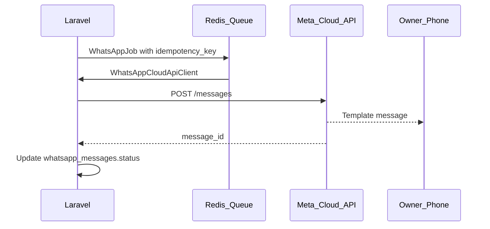

# WhatsApp Cloud API

[← Documentation hub](../README.md) | ADR [0007](../architecture/decisions/0007-whatsapp.md)

Meta WhatsApp Cloud API integration notes for Cash Flow Summary.

---

## Configuration

Stored in application settings (Owner admin UI), not committed to Git:

- Phone number ID
- WhatsApp Business Account ID
- Permanent access token (encrypted)
- Owner recipient phone (E.164)
- Webhook verify token

---

## Outbound flow



---

## Idempotency

Before send, check `whatsapp_messages.idempotency_key` unique.

Suggested key format: `{event_type}:{import_id}:{revision_id?}`

Duplicate job retries must not create second row with same key.

---

## Message templates

Register templates in Meta Business Manager. Initial templates (names TBD at integration):

| Event | Template purpose |
|-------|----------------|
| import_success | Successful import summary |
| import_duplicates | Import with duplicates |
| revision_pending | Awaiting Owner approval |
| revision_approved | Revision activated |
| missing_submission | Center did not submit |
| daily_summary | Consolidated end-of-day |

Template parameters: center name, period, row counts, HT/VAT/TTC totals, uploader — **no PII lists**.

---

## Webhook endpoint

```
POST /api/webhooks/whatsapp
GET  /api/webhooks/whatsapp  (verification challenge)
```

Verify `X-Hub-Signature-256` on POST.

Store raw events in `whatsapp_webhook_events`; update `whatsapp_messages` delivery status.

---

## Historical import rule

When `import_mode = historical` and `notify_owner = false`, skip WhatsApp job.

---

## Failure handling

- Retry with exponential backoff (max 3)
- Mark `failed` with `error_reason`
- Internal notification to Owner dashboard
- **Do not** roll back import transaction

---

## Health check

WhatsApp connectivity optional in `/health` — degraded if token invalid, not hard fail.

---

## Related

- REQ-090–REQ-095
- [security-privacy.md](../architecture/security-privacy.md)
