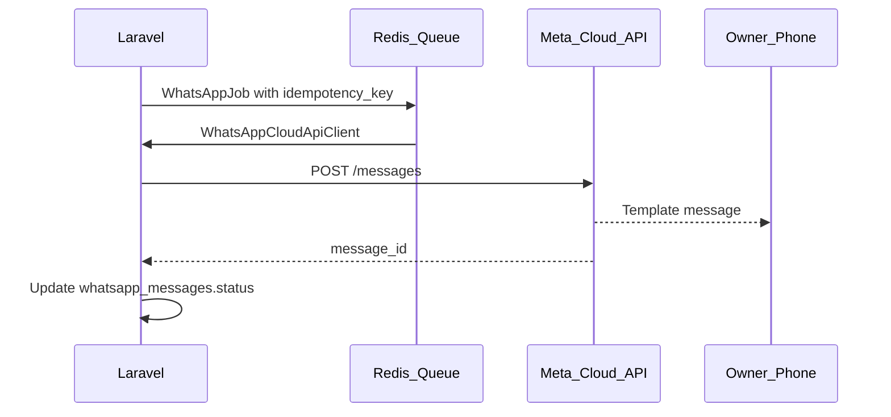

# WhatsApp Cloud API

[← Documentation hub](../README.md) | ADR [0007](../architecture/decisions/0007-whatsapp.md)

Meta WhatsApp Cloud API integration notes for Cash Flow Summary.

---

## Configuration

Stored in application settings (Owner admin UI), not committed to Git.

### Outbound messaging (required to send)

| Setting | Required | Notes |
|---------|----------|-------|
| Owner recipient phone (E.164) | Yes | Where alerts are delivered |
| Phone number ID | Yes | From Meta app / test number |
| Permanent access token | Yes | Encrypted at rest |

These three fields (plus phone number ID and access token from Meta) are **enough to send WhatsApp messages** during local and staging tests.

### Inbound webhooks (production; optional for testing)

| Setting | Required | Notes |
|---------|----------|-------|
| Webhook verify token | **Optional** | Shared secret for Meta GET verification challenge |

**Local / staging with Meta test number:** Meta’s WhatsApp **test number** flow provides phone number ID and access token but does **not** let you define a custom webhook verify token. Leave webhook verify token **empty** in Owner → WhatsApp Settings. Outbound sends work; delivery lifecycle updates are not expected.

**Production:** Configure the Meta webhook (URL + verify token) and enter the same verify token in WhatsApp Settings. The app uses it to validate `GET /api/webhooks/whatsapp` and to process inbound status events.

WhatsApp Business Account ID may be recorded for operator reference; it is not required for the send path implemented in this app.

---

## Configuration modes

| Mode | Settings | Outbound send | Delivery status updates |
|------|----------|---------------|-------------------------|
| **Testing** (Meta test number) | Owner phone, phone number ID, access token; webhook verify token **blank** | Yes | No — `sent` is the terminal status from the app’s perspective |
| **Production** | All outbound fields + webhook verify token + Meta webhook URL configured | Yes | Yes — `delivered`, `read`, `failed` updated from webhooks |

When webhook verify token is **not** configured, the application **must not** require it on save, **must not** register or enforce the webhook verification path, and **must ignore** delivered / read / failed status processing (Steps 97–98 implement this guard). When a verify token **is** present, webhook handling and delivery status updates behave normally.

---

## Outbound flow



---

## Idempotency

Before send, check `whatsapp_messages.idempotency_key` unique.

Suggested key format: `{event_type}:{import_id}:{revision_id?}`

Duplicate job retries must not create second row with same key.

---

## Message templates

Register templates in Meta Business Manager. Initial templates (names TBD at integration):

| Event | Template purpose |
|-------|----------------|
| import_success | Successful import summary |
| import_duplicates | Import with duplicates |
| revision_pending | Awaiting Owner approval |
| revision_approved | Revision activated |
| missing_submission | Center did not submit |
| daily_summary | Consolidated end-of-day |

Template parameters: center name, period, row counts, HT/VAT/TTC totals, uploader — **no PII lists**.

---

## Webhook endpoint

```
POST /api/webhooks/whatsapp
GET  /api/webhooks/whatsapp  (verification challenge)
```

**Active only when** `whatsapp.webhook_verify_token` is set in organization settings (production).

| Concern | Token configured | Token not configured (testing) |
|---------|------------------|--------------------------------|
| GET verification challenge | Validate `hub.verify_token` against stored token | Route not registered or returns 404 — expected |
| POST status events | Verify `X-Hub-Signature-256`; store in `whatsapp_webhook_events`; update `whatsapp_messages` | Ignored — no webhook processing |
| Message statuses | `delivered`, `read`, `failed` updated from Meta | Remain at `sent` (or `failed` only from outbound send retries) |

Store raw events in `whatsapp_webhook_events`; update `whatsapp_messages` delivery status when webhooks are enabled.

---

## Historical import rule

When `import_mode = historical` and `notify_owner = false`, skip WhatsApp job.

---

## Failure handling

- Retry with exponential backoff (max 3)
- Mark `failed` with `error_reason`
- Internal notification to Owner dashboard
- **Do not** roll back import transaction

---

## Health check

WhatsApp connectivity optional in `/health` — degraded if token invalid, not hard fail.

---

## Related

- REQ-090–REQ-096
- [security-privacy.md](../architecture/security-privacy.md)
