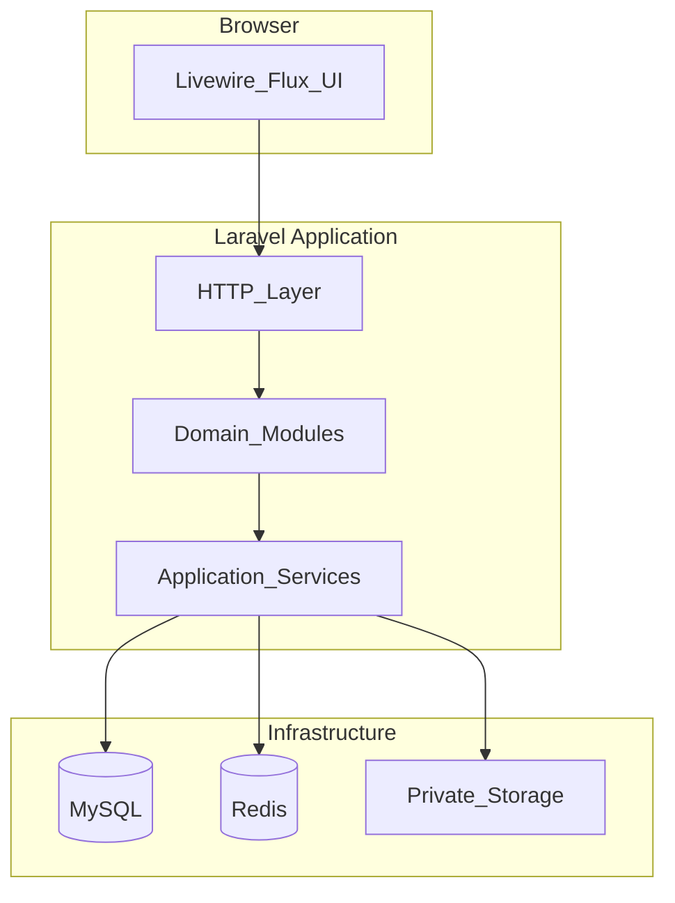
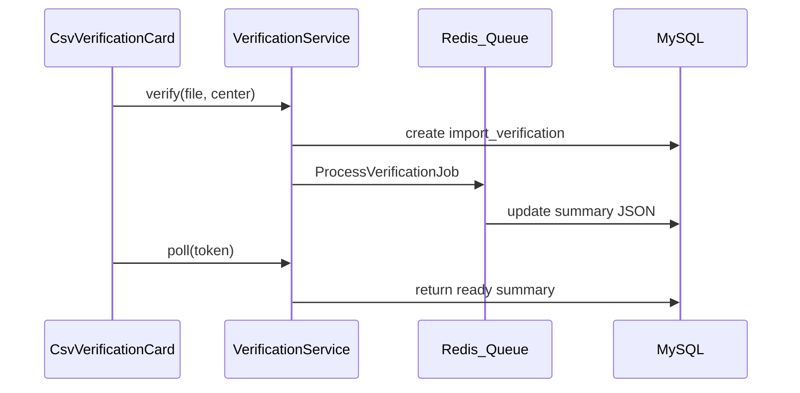
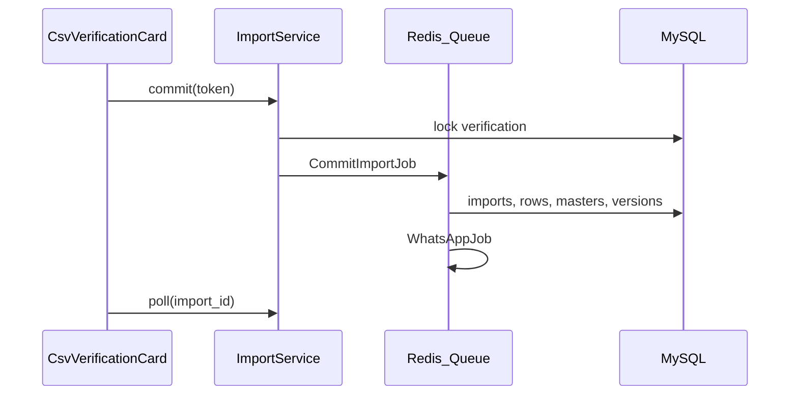

# Architecture Overview

[← Documentation hub](../README.md) | [plan.md](../../plan.md)

---

## Pattern

**Modular Laravel monolith** — one deployable application, clear module boundaries, shared database transactions.



---

## Modules

| Module | Responsibility |
|--------|----------------|
| Authentication | Login, 2FA, sessions, password policy |
| Centers | CRUD, operating calendar, exceptions |
| Users | CRUD, role assignment, center binding |
| CsvVerification | Temp storage, token, verify pipeline |
| CsvImports | Permanent import commit, history |
| Normalization | `field_specific_v1` canonical values |
| DuplicateDetection | Exact hash, similarity fingerprint |
| DailyVersions | Versioning, snapshots, revisions |
| Dashboards | Role-specific aggregate queries |
| Reports | Active-snapshot reports, exports |
| WhatsApp | Cloud API, idempotent queue |
| AuditLogging | Immutable audit events |
| SystemSettings | Org, WhatsApp, aliases |

Suggested path: `app/Modules/{ModuleName}/`

---

## Request flow — CSV verify



---

## Request flow — CSV import



Livewire never stores parsed rows — token and import ID only (ADR 0009).

---

## Queue architecture

| Queue | Jobs |
|-------|------|
| default | Small file verify/import |
| csv | Large parse, duplicate scan |
| reports | Summary regen, exports |
| whatsapp | Outbound messages |

Horizon for monitoring. Failed jobs retried per policy; WhatsApp failures do not roll back imports.

---

## Frontend stack

Livewire 3 + Flux UI + Tailwind (Midnight Finance) + Vite + Chart.js + Heroicons.

Shared layout: sidebar, header, flash messages, notification bell.

---

## Directory layout (target)

```
app/
  Modules/
    Authentication/
    Centers/
    CsvVerification/
    ...
  Http/Middleware/
  Policies/
database/migrations/
resources/views/
  components/
    csv-verification-card.blade.php
  layouts/
tests/
  Feature/
  Unit/
  fixtures/csv/
```

---

## Related

- [backend-services.md](backend-services.md)
- [security-privacy.md](security-privacy.md)
- [data-model.md](../design/data-model.md)
- ADRs in [decisions/](decisions/)
