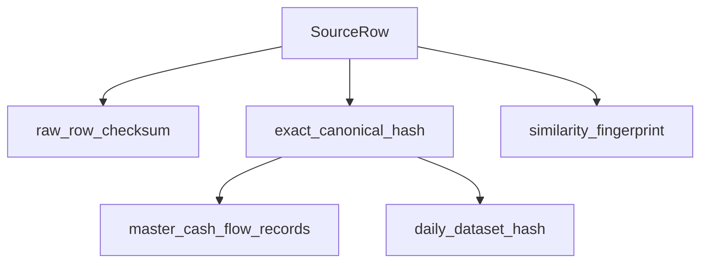

# Calculations and Financial Rules

[← Documentation hub](../README.md) | [normalization-policy.md](normalization-policy.md) | [csv-specification.md](csv-specification.md)

**Authoritative** for formulas, duplicate equality, and record classification.

---

## Row validation

| Check | Rule |
|-------|------|
| HT + VAT = TTC | Per row; mismatch → invalid |
| Negative amounts | Any < 0 → invalid (BR-004) |
| Zero-value | HT=VAT=TTC=0 → valid zero-value (BR-005) |
| Unfinished | null completion_date → unfinished, valid |
| Completed + zero TTC | Valid (e.g. CV counter-visit) |

---

## Footer reconciliation

```
parsed_row_count == footer_declared_count
sum(parsed_HT) == footer_HT
sum(parsed_VAT) == footer_VAT
sum(parsed_TTC) == footer_TTC
```

Mismatch → verification fails (Import disabled).

Only **valid** rows count toward parsed totals for reconciliation.

---

## Exact duplicate equality

All ten canonical fields must match for the **same center** after `field_specific_v1`:

1. registration_date
2. registration_time
3. completion_date (including both null)
4. customer_name (normalized)
5. category_code
6. inspection_type_code
7. licence_plate (normalized)
8. net_amount
9. vat_amount
10. gross_amount

Hash: `exact_canonical_hash = SHA-256(canonical_json + normalization_policy_version)`

On hash match, **recompare canonical fields** before confirming duplicate.

---

## Identity layers



| Layer | Purpose |
|-------|---------|
| raw_row_checksum | Audit — physical row as supplied |
| exact_canonical_hash | Master ledger uniqueness |
| similarity_fingerprint | Probable duplicate detection |
| daily_dataset_hash | Version comparison per center+date |

---

## Duplicate treatment

| Type | Behaviour |
|------|-----------|
| Exact duplicate | No new master; import_row links to existing master |
| Probable duplicate | Flagged in summary; informational (BR-017) |
| Within-file exact | Second+ occurrence flagged; not new master |

Duplicates **included** in duplicate statistics; **excluded** from new-master totals and active revenue.

---

## Daily versioning outcomes

Per center + registration_date (business date):

| Outcome | Action |
|---------|--------|
| **New** | Create and activate daily version |
| **Unchanged** | Keep active version |
| **Revision required** | Create proposed version; Owner approves |
| **Covered without rows** | Date in period but no rows — policy per import mode |
| **Invalid** | Cannot activate |

Reports and dashboards use **active daily snapshots only**.

---

## Summary totals (verification vs import)

### Verification summary (pre-import)

- Footer totals from source file
- Parsed totals from valid rows
- Duplicate preview counts (exact + probable)
- New unique count estimate

### Import result (post-import)

- Source rows processed
- New masters inserted
- Duplicates ignored (linked)
- Invalid rows skipped
- Daily impact: new / unchanged / revision required days

### Four total categories (import result clarity)

1. **Source totals** — entire file footer
2. **Duplicate totals** — sum of exact duplicate rows
3. **New master totals** — rows creating new masters
4. **Active daily effect** — change to approved snapshots

---

## Report aggregation

From `active_daily_snapshots` → linked `daily_versions` → member masters:

- TTC primary metric
- Group by day, week, month, year, center
- Exclude: temp verifications, rejected imports, superseded versions, rejected revisions

---

## Inspection types

| Code | Meaning |
|------|---------|
| C | Standard initial inspection |
| CV | Counter-visit; usually zero TTC |

---

## Money precision

Store as `DECIMAL(15,2)` in MySQL. Source is whole XAF; display with tabular numerals.
