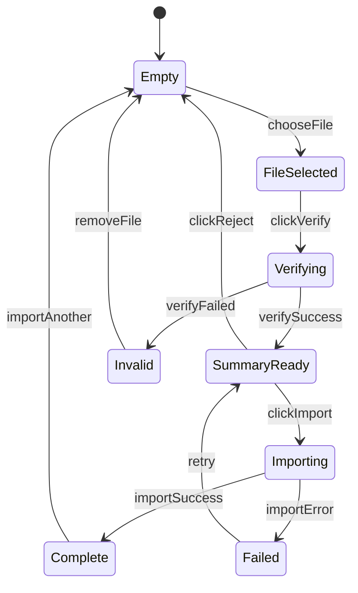

# CSV Verification Flow

[← Documentation hub](../README.md) | [csv-specification.md](csv-specification.md) | ADR [0009](../architecture/decisions/0009-verification-token-flow.md)

**Workflow:** Select file → Verify → Review summary → Import or Reject

---

## Principles

1. One compact card — not a multi-step wizard
2. No permanent financial data until **Import**
3. Livewire holds **verification token only** — never full parsed rows
4. Backend does inspection, parsing, reconciliation, duplicate preview
5. UI polls or refreshes status during async verify/import jobs

---

## Shared component

**`CsvVerificationCard`** (Livewire)

| Prop / context | Owner | Manager | Cashier |
|----------------|-------|---------|---------|
| Center | **Active center from session** (read-only on card) | Session center (read-only) | Session center (read-only) |
| Import mode | All three modes | All three modes | All three modes |
| Notify Owner (historical) | Checkbox | Checkbox | Checkbox |

Owner selects center on **Center Selection** page after login — not on the CSV card. Display: **Importing for: {active center name}**.

Three thin route wrappers; one component implementation.

---

## State machine

---

## UI states

### 1. Empty / initial

- Heading: **Import Cash-Flow Statement**
- Center (fixed or **active center from Owner session**; Owner selects center on Center Selection page, not here)
- Supported format note (UTF-8, semicolon, FR/EN)
- Import mode selector
- File input
- **Verify** button (disabled until file selected)

### 2. File selected

- Filename, size, selected time
- Remove file
- **Verify** enabled

### 3. Verifying

- Spinner on Verify button
- Disable file change
- Poll `import_verifications.status`

### 4. Summary ready

Replace/expand card with verification summary (sections below). Show **Import** (emerald primary) and **Reject** (secondary/destructive).

### 5. Importing

- Import button loading/disabled
- Double-submit prevention (token consumed once)

### 6. Complete

Redirect or inline transition to [import result page](#import-result-page).

### 7. Invalid

- Import disabled
- Error explanation
- Remove file → return to empty

---

## Verification summary panel

### File information

Filename, center, detected language, report period, actual record period, validation status.

### Footer summary (prominent)

| Summary | Value |
|---------|------:|
| Total records | Footer count |
| Amount excluding VAT | Footer HT |
| VAT amount | Footer VAT |
| **Total including VAT** | **Footer TTC** |

TTC: largest type, emerald or gold accent.

### Verification status

Structure, record-count, HT, VAT, TTC reconciliation — each Passed or Failed.

### Compact stats

Completed, unfinished, revenue-generating, zero-value, exact duplicates, new unique, invalid rows, probable duplicates (informational).

### Warnings (non-blocking)

Historical duplicates; in-file duplicates; unfinished rows; zero-value rows; revised date; filename vs actual period mismatch; unknown category/type codes.

---

## Import action

On **Import**:

1. Reconfirm center authorization
2. Lock verification token (single use)
3. `ImportService::commitFromVerification()` creates the `imports` row (`processing`), promotes the CSV to permanent storage, and marks the verification `imported`
4. Heavy work runs via **`ProcessImportJob`** (queued in production; inline when `CSV_IMPORTS_SYNC=true` / local+testing defaults):
   - Chunked `import_rows` insert (`CSV_IMPORTS_ROW_CHUNK`, default 500)
   - Chunked master ledger + day versions + summaries (`CSV_IMPORTS_LEDGER_CHUNK`)
5. Redirect to import result page immediately
6. Result page polls while status is `processing` (large files may take minutes)
7. No per-import WhatsApp; see [whatsapp-scheduled-summaries.md](../design/whatsapp-scheduled-summaries.md)

**Large files (10k+ rows):** supported via streaming parse + queued/chunked commit. Worker timeout defaults to **600s** (`CSV_IMPORTS_JOB_TIMEOUT` / Horizon). Keep `queue:work` or Horizon running when `CSV_IMPORTS_SYNC=false`.

---

## Reject action

On **Reject**:

1. Validate token
2. Delete temp file from private disk
3. Mark verification `rejected`
4. Audit: `verification_rejected` (no CSV body)
5. Return to empty card

---

## Import result page

- Import successful **or** still processing (auto-refresh)
- Center, file, period
- Source rows, new unique, duplicates ignored, invalid rows
- Active days created, unchanged days, revisions pending approval
- HT, VAT, TTC
- Note: activity included in scheduled WhatsApp summary (not sent immediately)
- Actions: Dashboard | Import details | Import another

While `status = processing`, the page polls every few seconds until a terminal status (`completed`, `completed_with_*`, `awaiting_owner_approval`, or `failed`).

---

## Temporary data (`import_verifications`)

| Field | Purpose |
|-------|---------|
| token | UUID exposed to Livewire |
| user_id, center_id | Authorization |
| temp_storage_path | Private disk path |
| import_mode | operational/historical/correction |
| notify_owner | boolean | Legacy historical flag; no immediate WhatsApp in v2.1 |
| footer_summary | JSON |
| validation_result | JSON (pass/fail per check) |
| row_stats | JSON (counts) |
| duplicate_summary | JSON |
| file_hash | Detect re-upload |
| status | pending / processing / ready / imported / rejected / expired / failed |
| expires_at | Auto cleanup |

**TTL:** 2 hours default for abandoned; immediate delete on Reject.

**Never** included in report queries.

---

## Invalid file handling

- No `imports` row created
- Temp file deleted after display or on expiry
- User can select new file

---

## Security

- Token bound to user + center + file hash
- Cannot import with another user's token
- Cannot import after Reject or expiry
- Owner `center_id` from **active session context** — validated by middleware, not from unvalidated form field

See [security-privacy.md](../architecture/security-privacy.md).
