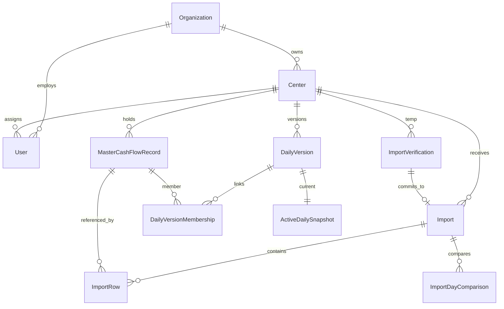
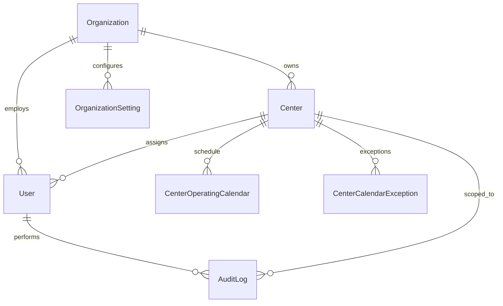

# Data Model

[← Documentation hub](../README.md) | [implementation-sequence.md](../implementation-sequence.md) | [calculations.md](calculations.md) | [erd-requirements-review.md](erd-requirements-review.md)

MySQL schema for Laravel modular monolith. Implement migrations in phase order: [implementation-sequence.md](../implementation-sequence.md).

**ERD review:** Step 25 complete (2026-07-01) — [erd-requirements-review.md](erd-requirements-review.md)

---

## Migration waves

### Wave 1 — Steps 25–31 (administration)

organizations, centers, center_operating_calendars, center_calendar_exceptions, users, roles, permissions, role_has_permissions, model_has_roles, model_has_permissions, organization_settings, audit_logs, sessions, cache, jobs, failed_jobs

### Wave 2 — Steps 40–42 (verification)

import_verifications, csv_format_versions, header_aliases

### Wave 3 — Steps 59–64 (financial)

imports, import_rows, import_errors, import_day_comparisons, master_cash_flow_records, anomalies, daily_versions, daily_version_memberships, active_daily_snapshots, daily_summaries, summary_breakdowns, export_requests, internal_notifications, whatsapp_messages, whatsapp_webhook_events

---

## Entity relationship

### Administrative entities (Wave 1)

Spatie permission tables (`roles`, `permissions`, pivots) link to `users` via `model_has_roles`. Laravel framework tables: `sessions`, `cache`, `jobs`, `failed_jobs`.

---

## organizations

| Column | Type | Notes |
|--------|------|-------|
| id | bigint PK | |
| name | string | |
| code | string unique | |
| currency | char(3) | Default XAF |
| timezone | string | e.g. Africa/Douala |
| default_language | string | fr/en |
| contact_details | json nullable | |
| logo_path | string nullable | |
| is_active | boolean | |
| timestamps | | |

---

## centers

| Column | Type | Notes |
|--------|------|-------|
| id | bigint PK | |
| organization_id | FK | |
| name | string | |
| code | string unique per org | |
| address, city, region | string nullable | |
| phone | string nullable | |
| default_language | string | |
| submission_deadline | time nullable | BR-008 |
| is_active | boolean | Soft deactivate only |
| timestamps | | |

---

## users

| Column | Type | Notes |
|--------|------|-------|
| id | bigint PK | |
| organization_id | FK | |
| center_id | FK nullable | **Null for Owner** |
| name | string | |
| username | string unique | Login identifier |
| phone | string nullable | |
| email | string nullable | Not used for auth |
| password | string | |
| is_active | boolean | |
| must_change_password | boolean | |
| two_factor_secret | text nullable | Owner |
| two_factor_recovery_codes | text nullable | |
| last_login_at | datetime nullable | |
| timestamps | | |

**Check:** Owner → `center_id` null; Manager/Cashier → `center_id` required.

---

## Owner active-center session

Stored in Laravel session (not `users` table):

| Session key | Type | Notes |
|-------------|------|-------|
| `active_center_id` | int | Owner operational scope |
| `active_organization_id` | int | Validated against center |
| `active_center_selected_at` | datetime | Audit / debugging |

Cleared when: logout, center deactivated, invalid center, explicit switch.

See [owner-active-center.md](owner-active-center.md) and ADR 0011.

---

## center_operating_calendars

| Column | Type | Notes |
|--------|------|-------|
| id | bigint PK | |
| center_id | FK | |
| day_of_week | tinyint | 0–6 |
| is_open | boolean | |
| open_time, close_time | time nullable | |

---

## center_calendar_exceptions

| Column | Type | Notes |
|--------|------|-------|
| id | bigint PK | |
| center_id | FK | |
| exception_date | date | |
| type | enum | holiday, closure, special_open |
| open_time, close_time | time nullable | |
| notes | text nullable | |

---

## roles and permissions

Spatie Laravel Permission package. Seed: `owner`, `center_manager`, `cashier`. Permissions per [permission-matrix.md](../product/permission-matrix.md).

---

## organization_settings

Organization-scoped configuration (WhatsApp, security defaults). Secrets encrypted at rest. **Added Step 25 review (REQ-095, BR-018).**

| Column | Type | Notes |
|--------|------|-------|
| id | bigint PK | |
| organization_id | FK | |
| key | string | Unique per organization |
| value | text | JSON or scalar; encrypt sensitive keys in app |
| updated_by | FK nullable | User who last changed setting |
| timestamps | | |

**Example keys:** `whatsapp.owner_phone`, `whatsapp.phone_number_id`, `whatsapp.access_token`, `whatsapp.webhook_verify_token`

---

## import_verifications

Temporary pre-import state. **Not** in report queries.

| Column | Type | Notes |
|--------|------|-------|
| id | bigint PK | |
| token | uuid unique | Exposed to Livewire |
| user_id | FK | |
| center_id | FK | |
| import_mode | enum | operational, historical, correction |
| notify_owner | boolean | Historical WhatsApp opt-in |
| original_filename | string | |
| temp_storage_path | string | Private disk |
| file_size | bigint | |
| file_hash | string | SHA-256 |
| source_language | string nullable | fr/en |
| encoding | string nullable | |
| delimiter | char(1) nullable | |
| reported_period | string nullable | From filename/metadata |
| actual_period_start | date nullable | |
| actual_period_end | date nullable | |
| footer_summary | json | count, ht, vat, ttc |
| validation_result | json | structure, reconciliation flags |
| row_stats | json | completed, unfinished, zero, invalid counts |
| duplicate_summary | json | exact, probable, new_unique counts |
| status | enum | See import-statuses |
| error_message | text nullable | |
| import_id | FK nullable | Set after commit |
| expires_at | datetime | Default +2 hours |
| verified_at | datetime nullable | |
| committed_at | datetime nullable | |
| rejected_at | datetime nullable | |
| timestamps | | |

**Index:** `(token)`, `(status, expires_at)`, `(user_id, center_id)`

---

## csv_format_versions

| Column | Type | Notes |
|--------|------|-------|
| id | bigint PK | |
| name, code | string | |
| version | string | |
| column_count | int | 10 |
| delimiter | char(1) | ; |
| encoding | string | UTF-8 |
| is_active | boolean | |
| timestamps | | |

---

## header_aliases

| Column | Type | Notes |
|--------|------|-------|
| id | bigint PK | |
| csv_format_version_id | FK | |
| canonical_field | string | |
| language | enum | fr, en |
| source_header | string | Exact source text |
| normalized_header | string | For matching |
| is_required | boolean | |
| is_active | boolean | |
| created_by | FK nullable | Owner |
| timestamps | | |

---

## imports

| Column | Type | Notes |
|--------|------|-------|
| id | bigint PK | |
| center_id | FK | |
| import_verification_id | FK nullable | Source verification |
| uploaded_by | FK | |
| approved_by | FK nullable | Revision approval |
| import_mode | enum | |
| source_language | string | |
| original_filename | string | |
| storage_path | string | Permanent private path |
| file_hash | string | |
| file_size | bigint | |
| encoding, delimiter | string, char | |
| reported_period | string nullable | |
| actual_period_start, actual_period_end | date nullable | |
| declared_count | int | Footer |
| parsed_count | int | |
| invalid_count | int | |
| duplicate_within_file_count | int | |
| historical_duplicate_count | int | |
| new_master_count | int | |
| source_ht, source_vat, source_ttc | decimal(15,2) | Footer |
| calculated_ht, calculated_vat, calculated_ttc | decimal(15,2) | |
| status | enum | import-statuses |
| warnings | json nullable | |
| processing_started_at | datetime nullable | |
| completed_at | datetime nullable | |
| timestamps | | |

**Unique:** `(center_id, file_hash)` for exact file duplicate detection.

---

## import_rows

| Column | Type | Notes |
|--------|------|-------|
| id | bigint PK | |
| import_id | FK | |
| center_id | FK | Denormalized for scope |
| source_row_number | int | |
| business_date | date | registration_date |
| original_values | json | |
| canonical_values | json | |
| raw_row_checksum | char(64) | |
| exact_canonical_hash | char(64) | |
| similarity_fingerprint | char(64) nullable | |
| normalization_policy_version | string | field_specific_v1 |
| master_record_id | FK nullable | |
| row_status | enum | |
| duplicate_type | enum nullable | |
| duplicate_of_import_row_id | FK nullable | |
| validation_errors | json nullable | |
| timestamps | | |

---

## master_cash_flow_records

| Column | Type | Notes |
|--------|------|-------|
| id | bigint PK | |
| center_id | FK | |
| registration_date | date | |
| registration_time | time | |
| completion_date | date nullable | |
| customer_name | string | Display |
| customer_name_normalized | string | Search |
| category_code | string | |
| inspection_type_code | string | |
| licence_plate | string | Display |
| licence_plate_normalized | string | Search |
| net_amount, vat_amount, gross_amount | decimal(15,2) | |
| completion_status | enum | completed, unfinished |
| financial_status | enum | revenue, zero_value |
| exact_canonical_hash | char(64) | |
| normalization_policy_version | string | |
| first_import_id | FK | |
| first_import_row_id | FK | |
| first_seen_at | datetime | |
| timestamps | | |

**Unique:** `(center_id, normalization_policy_version, exact_canonical_hash)`

---

## import_day_comparisons

| Column | Type | Notes |
|--------|------|-------|
| id | bigint PK | |
| import_id | FK | |
| center_id | FK | |
| business_date | date | |
| comparison_result | enum | |
| existing_version_id | FK nullable | |
| proposed_version_id | FK nullable | |
| existing_ht, existing_vat, existing_ttc | decimal nullable | |
| proposed_ht, proposed_vat, proposed_ttc | decimal nullable | |
| record_count_delta | int nullable | |
| timestamps | | |

---

## daily_versions

| Column | Type | Notes |
|--------|------|-------|
| id | bigint PK | |
| center_id | FK | |
| business_date | date | |
| import_id | FK nullable | |
| version_number | int | |
| dataset_hash | char(64) | |
| record_count | int | |
| total_ht, total_vat, total_ttc | decimal(15,2) | |
| status | enum | |
| previous_version_id | FK nullable | |
| revision_reason | text nullable | |
| submitted_by | FK nullable | |
| approved_by | FK nullable | |
| approved_at | datetime nullable | |
| rejected_reason | text nullable | |
| timestamps | | |

**Unique:** `(center_id, business_date, version_number)`

---

## daily_version_memberships

| Column | Type | Notes |
|--------|------|-------|
| id | bigint PK | |
| daily_version_id | FK | |
| master_cash_flow_record_id | FK | |
| timestamps | | |

**Unique:** `(daily_version_id, master_cash_flow_record_id)`

---

## active_daily_snapshots

| Column | Type | Notes |
|--------|------|-------|
| id | bigint PK | |
| center_id | FK | |
| business_date | date | |
| daily_version_id | FK | |
| activated_at | datetime | |
| timestamps | | |

**Unique:** `(center_id, business_date)`

---

## anomalies

| Column | Type | Notes |
|--------|------|-------|
| id | bigint PK | |
| center_id | FK | |
| import_id | FK nullable | |
| type | string | |
| description | text | |
| metadata | json | |
| resolved_at | datetime nullable | |
| timestamps | | |

---

## import_errors

| Column | Type | Notes |
|--------|------|-------|
| id | bigint PK | |
| import_id | FK nullable | Null during verify-only errors |
| import_verification_id | FK nullable | |
| source_row_number | int nullable | |
| field | string nullable | |
| error_code | string | |
| original_value | text nullable | |
| raw_row | text nullable | |
| timestamps | | |

---

## daily_summaries / summary_breakdowns

Denormalized aggregates from active snapshots for report performance. Regeneratable.

---

## export_requests

| Column | Type | Notes |
|--------|------|-------|
| id | bigint PK | |
| user_id | FK | |
| center_id | FK nullable | Required for operational exports; Owner uses active center |
| report_type | string | |
| filters | json | |
| format | enum | csv, xlsx, pdf |
| status | enum | |
| storage_path | string nullable | |
| expires_at | datetime nullable | |
| completed_at | datetime nullable | |
| timestamps | | |

---

## internal_notifications

| Column | Type | Notes |
|--------|------|-------|
| id | bigint PK | |
| user_id | FK | |
| center_id | FK nullable | |
| type | string | |
| title | string | |
| body | text | |
| read_at | datetime nullable | |
| related_type, related_id | morph nullable | |
| timestamps | | |

---

## whatsapp_messages

| Column | Type | Notes |
|--------|------|-------|
| id | bigint PK | |
| idempotency_key | string unique | |
| center_id | FK nullable | |
| import_id | FK nullable | |
| event_type | string | |
| recipient_phone | string | |
| template_name | string nullable | |
| payload_summary | json | Aggregates only |
| status | enum | |
| provider_message_id | string nullable | |
| error_reason | text nullable | |
| retry_count | int | |
| sent_at, delivered_at, read_at | datetime nullable | |
| timestamps | | |

---

## whatsapp_webhook_events

| Column | Type | Notes |
|--------|------|-------|
| id | bigint PK | |
| provider_event_id | string unique | |
| payload | json | |
| processed_at | datetime nullable | |
| timestamps | | |

---

## audit_logs

| Column | Type | Notes |
|--------|------|-------|
| id | bigint PK | |
| user_id | FK nullable | |
| center_id | FK nullable | |
| event | string | |
| resource_type | string nullable | |
| resource_id | bigint nullable | |
| old_values | json nullable | |
| new_values | json nullable | |
| reason | text nullable | |
| ip_address | string nullable | |
| user_agent | text nullable | |
| created_at | datetime | |

---

## Core constraints summary

| Constraint | Rule |
|------------|------|
| Owner center | `users.center_id` null for Owner role |
| Manager/Cashier center | `center_id` required |
| Master uniqueness | `(center_id, normalization_policy_version, exact_canonical_hash)` |
| Active snapshot | One per `(center_id, business_date)` |
| File hash | Unique per `(center_id, file_hash)` on imports |
| Verification token | UUID unique; single-use on import |
| WhatsApp | Unique `idempotency_key` |

---

## Indexing strategy

| Index | Purpose |
|-------|---------|
| (center_id, registration_date) | Reports |
| (center_id, file_hash) | File duplicate |
| (center_id, exact_canonical_hash) | Master lookup |
| licence_plate_normalized | Search |
| customer_name_normalized | Search |
| import_verifications (status, expires_at) | Cleanup job |
| imports.status | Monitoring |
| daily_versions.status | Approval queue |
| audit_logs.created_at | Audit queries |

---

## Migration order

**Wave 1 (Steps 25–31):** organizations → centers → users → permission tables → operating_calendars → calendar_exceptions → organization_settings → audit_logs

**Wave 2 (Steps 40–42):** csv_format_versions → header_aliases → import_verifications

**Wave 3 (Steps 59–64):** imports → master_cash_flow_records → import_rows → import_day_comparisons → daily_versions → memberships → active_snapshots → anomalies → import_errors → summaries → export_requests → notifications → whatsapp tables

---

## Computed vs stored

| Data | Stored | Computed |
|------|--------|----------|
| Master records | yes | — |
| Import rows | yes | — |
| exact_canonical_hash | yes at insert | algorithm in calculations.md |
| Report totals | daily_summaries (cache) | regeneratable from active snapshots |
| Verification summary | import_verifications JSON | rebuilt only on re-verify |
