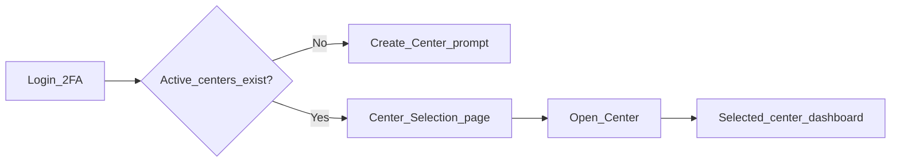

# Owner Active-Center Architecture

[← Documentation hub](../README.md) | [ux-overview.md](ux-overview.md) | ADR [0011](../architecture/decisions/0011-owner-active-center.md)

**Principle:** The Owner has authority over all centers but works within **one explicitly selected active center** at a time. No consolidated operational dashboard. No `All Centers` option.

---

## 1. Core principle

| Layer | Behaviour |
|-------|-----------|
| **Organization administration** | Owner manages all centers and users (list views, CRUD) |
| **Operational work** | Scoped to **active working center** only |

The Owner does **not** view or work with all centers simultaneously on operational pages.

---

## 2. Owner login flow

1. Username + password
2. Two-factor authentication (when enabled)
3. Confirm Owner role
4. Check active centers exist
5. Redirect to **Center Selection** page
6. Owner selects one center
7. Store as **active working center** in session
8. Redirect to that center’s dashboard

**Workflow:** Login → Select center → Dashboard → Work within that center

---

## 3. Center Selection page

**Heading:** Select a Center

**Supporting text:** Choose the center whose cash-flow information you want to view or manage.

### Dropdown

Searchable list of **active centers only**. Each option may show:

- Center name
- Center code
- City / location

Example: `NACHO Yaounde — YDE-MENDONG`

### Continue

**Open Center** button — primary emerald, icon `building-office-2` or `arrow-right-circle`.

### Empty state

No dropdown when zero centers:

> No center has been created yet. Create your first center to continue.

Primary action: **Create Center**

---

## 4. Active-center session

Stored after selection (server-side session):

| Field | Purpose |
|-------|---------|
| `owner_user_id` | Authenticated Owner |
| `organization_id` | Owner’s organization |
| `active_center_id` | Selected center |
| `selected_at` | Timestamp |

**Never trust** `center_id` from the browser alone. Every request validates:

- Owner authenticated
- Center exists
- Center belongs to Owner’s organization
- Center is active
- Owner authorized to access it

---

## 5. Active-center header

Prominent display after selection:

**Active Center: NACHO Yaounde**

Located in top navigation near page heading or user menu — not hidden in settings.

### Center-switching dropdown

The active-center display **is** a dropdown. Switching:

1. Validate new center
2. Replace session active center
3. Clear center-dependent page filters
4. Redirect to new center’s dashboard
5. Load only new center’s data

**Forbidden options:** All Centers, Global Overview, Consolidated View, Every Center

---

## 6. Selected-center Owner dashboard

**Title example:** `NACHO Yaounde Cash-Flow Dashboard`

### Header

Active center name | reporting period | date filter | Import CSV | export | last import | center-switch dropdown

### Row 1 — primary stats (active center only)

Total TTC | Total HT | Total VAT | Active unique records

### Row 2 — secondary

Completed | Unfinished | Zero-value | Duplicates ignored

### Row 3

Revenue trend chart (8 cols): daily / weekly / monthly / yearly toggle  
Submission & alerts panel (4 cols)

### Row 4

Recent imports table (active center only)

### Alerts (active center only)

Reconciliation failure, revision pending, probable duplicate, missing report, failed import, WhatsApp failure, unfinished-record warning

**Removed:** Organization-wide consolidated dashboard, center comparison table, multi-center TTC totals.

---

## 7. Operational pages (auto-scoped)

All use active center — **no second center picker** on these pages.

| Page | Display |
|------|---------|
| CSV verification | **Importing for: {center name}** |
| Imports | Active center only |
| Records | Active center only |
| Daily versions | Active center only |
| Revisions | Active center only |
| Reports | Active center only |
| Anomalies | Active center only |
| WhatsApp history | Active center only |
| Operational audit | Filtered to active center |

CSV workflow unchanged: Select file → Verify → Import or Reject

---

## 8. Administrative pages

Accessible without active center (or alongside it):

- Manage Centers, Create/Edit Center
- Manage Users, Create User, Reset Password, Reassign User
- Organization Settings, WhatsApp Configuration, Security Settings
- Audit Logs (organization-wide admin view)

### Manage Centers

Lists all centers with **operational metadata** — not combined financial totals:

- Name, code, location, assigned user count, active status
- Edit | **Open Center** (sets active + redirect to dashboard)

### Manage Users

Organization-wide list with filters: center, role, active status, name, username. Administrative — not a financial interface.

---

## 9. Navigation

### Operational (requires active center)

Dashboard | Import CSV | Imports | Records | Daily Versions | Revisions | Reports | Anomalies | WhatsApp History

### Administrative (separate section)

Manage Centers | Manage Users | Organization Settings | WhatsApp Settings | Security | Audit Logs

Visual separation prevents confusing admin with center operations.

---

## 10. Missing active center

Center-dependent routes without active center → redirect to Center Selection (preserve intended URL; redirect after selection).

**Admin routes** (Manage Centers, etc.) remain accessible.

---

## 11. Inactive or invalid active center

If active center deactivated or unavailable:

1. Clear from session
2. Redirect to Center Selection
3. Show explanatory message
4. Block operational pages until valid center selected

Historical data preserved in database.

---

## 12. Middleware: `EnsureOwnerActiveCenter`

| Responsibility |
|----------------|
| Confirm Owner authentication |
| Read active center from session |
| Validate organization ownership and active status |
| Attach `ActiveCenterContext` to request |
| Redirect to Center Selection if missing on operational routes |
| Clear invalid context |

Manager and Cashier use `EnsureAssignedCenter` from user account — **no** Owner center dropdown.

---

## 13. Backend query rules

Operational services receive **verified active-center context** — not arbitrary `center_id` from request.

| Service | Scope |
|---------|-------|
| Dashboard | active center |
| Import / verification | active center |
| Reports | active center |
| Record search | active center |
| Revision approve | revision must belong to active center |
| File download | import must belong to active center |

---

## 14. Queue jobs

Jobs use **`import.center_id`** (or `import_verification.center_id`) from the database record — **never** Owner’s current session.

Reason: Owner may switch centers while job runs; session is unreliable in background.

---

## 15. Browser tabs

- Active center is session-based (shared across tabs)
- Each page shows center name visibly
- Import confirmation repeats center name
- Switching center in one tab affects session for all tabs
- Existing import records unchanged when session center switches

Optional future: center code in URL with session validation.

---

## 16. Implementation order (Owner)

**Foundation:** Login → 2FA → Center Selection → active session → header dropdown → selected-center dashboard → switching

**Administration:** Manage Centers (Open Center) → Users → settings

**Operational:** CSV → imports → records → versions → revisions → reports → anomalies → WhatsApp history

---

## 17. Acceptance criteria

See [acceptance-criteria.md](../testing/acceptance-criteria.md) Owner active-center section (items 37–54).

---

## Related

- [csv-verification-flow.md](csv-verification-flow.md)
- [permission-matrix.md](../product/permission-matrix.md)
- [business-rules.md](../product/business-rules.md) BR-019–BR-022
