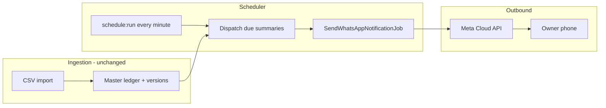

# Scheduled WhatsApp activity summaries

[← Documentation hub](../README.md) | ADR [0012](../architecture/decisions/0012-whatsapp-scheduled-summaries.md)

Owner-facing WhatsApp notifications are **scheduled summaries** of center activity — not per-import alerts.

---

## Overview



---

## Cadences and periods

All times use **`APP_TIMEZONE`** (default `Africa/Douala`).

| Event type | `event_type` value | Fire condition | Period in message |
|------------|-------------------|----------------|-------------------|
| Daily | `daily_summary` | Every **operating day** at center time (see below) | **That calendar day from 00:00 through the send time** (inclusive). Example: send at 18:00 on 10/07/2026 → period is 10/07/2026, counts/TTC for activity recorded that day up to 18:00. |
| Weekly | `weekly_summary` | Every **Saturday** at center time | `dd/mm/yyyy – dd/mm/yyyy` (Mon–Sat) |
| Monthly | `monthly_summary` | **Last day of month** at center time | `01/mm/yyyy – last/mm/yyyy` |
| Yearly | `yearly_summary` | **31 December** at center time | `01/01/yyyy – 31/12/yyyy` |

**Daily period rule:** Summarize the **current calendar day at send time** — from `00:00` to the configured center time on that date (`APP_TIMEZONE`). Not the previous day.

**Daily send rule (operating calendar):** Send the daily summary **only if today is an operating day** for that center. Use the same rules as submission / missing-report logic (`center_operating_calendars` + `center_calendar_exceptions`):

| Source | Rule |
|--------|------|
| Weekly schedule | `center_operating_calendars.is_open = true` for today's `day_of_week` (0 = Sunday … 6 = Saturday) |
| Calendar exception on today's date | `holiday` or `closure` → **not** an operating day (skip daily send) |
| Calendar exception on today's date | `special_open` → operating day (send daily summary) |

Configured in **Manage Centers → Operating calendar** (BR-009, BR-010, REQ-021).

If today is **not** an operating day, **no daily WhatsApp** is sent. Activity on that date is still included in **weekly**, **monthly**, and **yearly** summaries when those cadences run.

**Week definition:** Monday 00:00 through Saturday 23:59 of the week containing the send date. On Saturday, the summary covers the current week Mon–Sat.

**Overlapping sends:** When multiple cadences fall on the same day (e.g. 31 Dec on Saturday), each cadence sends a **separate** message with its own `event_type` and idempotency key.

---

## Per-center configuration

| Field | Storage | Who sets | Notes |
|-------|---------|----------|-------|
| Summary send time | `centers.whatsapp_summary_time` (`TIME`, nullable) | Owner on center edit | Default `18:00` when null |
| WhatsApp credentials | `organization_settings` | Owner on WhatsApp Settings | Unchanged (REQ-095) |

Centers without outbound WhatsApp configured for the organization are skipped.

---

## Message content

Same Meta template **`import_activity_summary`** (seven named body parameters):

| Parameter | Source for scheduled summary |
|-----------|---------------------------|
| `center_name` | `centers.name` |
| `import_period` | Formatted period per cadence (above) |
| `inspection_count` | Count of active master records in period |
| `category_summary` | `A: n, B: n, B1: n, C: n, D: n` for period |
| `amount_ht` | Sum of active snapshot HT in period |
| `amount_vat` | Sum of VAT |
| `amount_ttc` | Sum of TTC |

Aggregation reuses active daily snapshot logic (`ReportQueryService`, `ImportPeriodCategorySummaryService` or successor scoped by date range).

**No PII** — same rules as ADR 0007.

---

## Scheduler behaviour

1. Artisan command `whatsapp:dispatch-scheduled-summaries` registered in `routes/console.php` → **every minute**.
2. For each **active** center with `whatsapp_summary_time` due in the current minute:
   - If **daily** cadence applies today, call `OperatingCalendarService` / `SubmissionStatusService` equivalent (`isOperatingDay`) — **skip daily** when false.
   - Evaluate which other cadences apply **today** (weekly / monthly / yearly).
   - For each applicable cadence, call `WhatsAppNotificationService::queueScheduledSummary($center, $cadence, $period)`.
3. Service builds payload, `firstOrCreate` on idempotency key, dispatches `SendWhatsAppNotificationJob` if new and queued.

**Missed minute:** If `schedule:run` is down, that minute’s window is missed (no retroactive catch-up in v1). Operations must run scheduler reliably.

**Empty periods:** Still send with zero counts and zero amounts so the Owner sees explicit “no activity” for that window.

---

## What no longer sends WhatsApp

| Removed trigger | Notes |
|-----------------|-------|
| `ImportService::commitFromVerification()` | Remove `queueImportNotification()` call |
| Historical `notify_owner` immediate send | Checkbox may remain for future use or be removed from UI in a follow-up; no outbound message |

---

## WhatsApp history

| Column / field | Change |
|----------------|--------|
| `event_type` | New values: `weekly_summary`, `monthly_summary`, `yearly_summary`; legacy import event types remain on old rows |
| `import_id` | Nullable; scheduled summaries do not link to a single import |
| `payload_summary` | Adds `cadence`, `period_start`, `period_end`, existing aggregate fields |

History UI labels (EN/FR) updated under `whatsapp.event_type.*`.

---

## Import result page

Remove live “WhatsApp status” for the committed import. Replace with copy: activity will be included in the next scheduled summary for this center (daily / weekly / monthly / yearly per schedule).

---

## Operations

Production `crontab` (in addition to queue worker):

```cron
* * * * * cd /path/to/app && php artisan schedule:run >> /dev/null 2>&1
```

Horizon or `queue:work` must process `SendWhatsAppNotificationJob`.

---

## Related

- [csv-verification-flow.md](csv-verification-flow.md)
- [api/README.md](../api/README.md)
- [business-rules.md](../product/business-rules.md) — BR-014, BR-024
