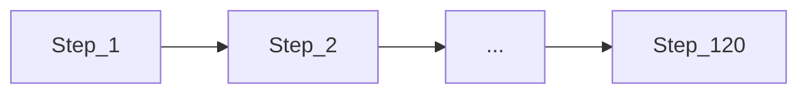

# Chronological Implementation Sequence

[← Documentation hub](../README.md) | [plan.md](../../plan.md) | [roadmap.md](../product/roadmap.md)

**Purpose:** Single linear order for building Cash Flow Summary — **one step at a time**, strictly chronological.

**How to use this document**

1. Work **Step 1 → Step 120** in order — do not skip.
2. **Complete Step N** (deliverable done, local verification) before starting Step N+1.
3. At each **checkpoint** (end of a step group), pass gate criteria before continuing.
4. Topic docs (CSV spec, data model, UX) are **references** during the step that needs them.

**Rule:** Step wins over Phase/Sprint when they conflict.

---

## Current status

| Item | Value |
|------|-------|
| Doc set | v2.1.09 |
| Steps complete | **1–108** |
| **Next step** | **Step 109** — Docker Compose — nginx, app, mysql, redis, horizon |
| **Global UI rule** | Every screen: professional design, blended Midnight Finance colors — [design-system.md § Design quality standard](../design/design-system.md#design-quality-standard-project-wide) |
| Guide | [setup.md](../operations/setup.md) |

---

## Step index

| Step | Task | Group | Sprint | Status |
|------|------|-------|--------|--------|
| 1 | Charter, stakeholders, change control, risks | Documentation & governance | — | Complete |
| 2 | Requirements, business rules, permissions | Documentation & governance | — | Complete |
| 3 | CSV spec, calculations, normalization | Documentation & governance | — | Complete |
| 4 | Data model specification | Documentation & governance | — | Complete |
| 5 | UX, design system, owner active-center | Documentation & governance | — | Complete |
| 6 | Architecture, ADRs, services | Documentation & governance | — | Complete |
| 7 | Test strategy, acceptance criteria | Documentation & governance | — | Complete |
| 8 | Master plan | Documentation & governance | — | Complete |
| 9 | Approve charter and requirements | Project & repository setup | S1 | Complete |
| 10 | Initialize Git repository | Project & repository setup | S1 | Complete |
| 11 | Install local prerequisites (PHP, MySQL, Redis, Node) | Project & repository setup | S1 | Complete |
| 12 | Create MySQL database and app user | Project & repository setup | S1 | Complete |
| 13 | `composer create-project` / scaffold Laravel | Laravel & stack installation | S1 | Complete |
| 14 | Install Livewire, Flux UI, Tailwind, Vite | Laravel & stack installation | S1 | Complete |
| 15 | Install Redis, Horizon, Pest | Laravel & stack installation | S1 | Complete |
| 16 | Configure `.env.example` | Laravel & stack installation | S1 | Complete |
| 17 | Create modular folder structure `app/Modules/` | Laravel & stack installation | S1 | Complete |
| 18 | CI pipeline skeleton (test + build) | Laravel & stack installation | S1 | Complete |
| 19 | Tailwind tokens — Midnight Finance colors, fonts | Design system & frontend shell | S1 | Complete |
| 20 | Heroicons via Flux (no extra icon packages) | Design system & frontend shell | S1 | Complete |
| 21 | App layout: sidebar (navy), top bar, content area | Design system & frontend shell | S1 | Complete |
| 22 | Role-based navigation structure (empty routes OK) | Design system & frontend shell | S1 | Complete |
| 23 | Reusable card, button, table, badge patterns | Design system & frontend shell | S1 | Complete |
| 24 | Responsive behaviour (mobile sidebar) | Design system & frontend shell | S1 | Complete |
| 25 | Review ERD against requirements | Database Wave 1 — administration | S1 | Complete |
| 26 | Migration: organizations | Database Wave 1 — administration | S1 | Complete |
| 27 | Migration: centers, operating_calendars, calendar_exceptions | Database Wave 1 — administration | S1 | Complete |
| 28 | Migration: users | Database Wave 1 — administration | S1 | Complete |
| 29 | Migration: roles & permissions (Spatie) | Database Wave 1 — administration | S1 | Complete |
| 30 | Migration: audit_logs | Database Wave 1 — administration | S1 | Complete |
| 31 | Seed: roles, Owner account | Database Wave 1 — administration | S1 | Complete |
| 32 | Login page (Midnight Finance) | Authentication, roles & center context | S1 | Complete |
| 33 | Session, rate limiting, password policy | Authentication, roles & center context | S1 | Complete |
| 34 | Owner 2FA (TOTP) | Authentication, roles & center context | S1 | Complete |
| 35 | Temporary password → forced change | Authentication, roles & center context | S1 | Complete |
| 36 | `EnsureAssignedCenter` middleware (Manager/Cashier) | Authentication, roles & center context | S1 | Complete |
| 37 | `EnsureOwnerActiveCenter` middleware skeleton | Authentication, roles & center context | S1 | Complete |
| 38 | Policies and center query scopes | Authentication, roles & center context | S1 | Complete |
| 39 | Pest: center isolation smoke tests | Authentication, roles & center context | S1 | Complete |
| 40 | Migration: csv_format_versions, header_aliases | Database Wave 2 — verification | S2 | Complete |
| 41 | Migration: import_verifications | Database Wave 2 — verification | S2 | Complete |
| 42 | Seed: header aliases (FR/EN, Regitration variants) | Database Wave 2 — verification | S2 | Complete |
| 43 | VerificationService — temp file, token, TTL | CSV verification backend | S2 | Complete |
| 44 | CsvInspectionService — encoding, delimiter, language | CSV verification backend | S2 | Complete |
| 45 | HeaderMappingService — reject mixed language | CSV verification backend | S2 | Complete |
| 46 | CsvParsingService — stream rows | CSV verification backend | S2 | Complete |
| 47 | FooterReaderService + ReconciliationService | CSV verification backend | S2 | Complete |
| 48 | NormalizationService — `field_specific_v1` | CSV verification backend | S2 | Complete |
| 49 | DuplicatePreviewService — exact + probable counts | CSV verification backend | S2 | Complete |
| 50 | VerificationCleanupService (scheduled) | CSV verification backend | S2 | Complete |
| 51 | Pest fixtures: FR/EN, mixed headers, invalid rows | CSV verification backend | S2 | Complete |
| 52 | Center Selection page (post-login) | Owner administration UI | S3 | Complete |
| 53 | Active-center session + header dropdown | Owner administration UI | S3 | Complete |
| 54 | Manage Centers — CRUD, Open Center action | Owner administration UI | S3 | Complete |
| 55 | Operating calendar UI | Owner administration UI | S3 | Complete |
| 56 | Manage Users — CRUD, reassign, reset password | Owner administration UI | S3 | Complete |
| 57 | Organization / WhatsApp / security settings shells | Owner administration UI | S3 | Complete |
| 58 | Audit log list (admin) | Owner administration UI | S3 | Complete |
| 59 | Migration: imports, import_rows, import_errors | Database Wave 3 — financial | S5 | Complete |
| 60 | Migration: master_cash_flow_records (unique constraint) | Database Wave 3 — financial | S5 | Complete |
| 61 | Migration: import_day_comparisons | Database Wave 3 — financial | S5 | Complete |
| 62 | Migration: daily_versions, memberships, active_daily_snapshots | Database Wave 3 — financial | S5 | Complete |
| 63 | Migration: anomalies, summaries, export_requests | Database Wave 3 — financial | S5 | Complete |
| 64 | Migration: whatsapp_messages, internal_notifications | Database Wave 3 — financial | S5 | Complete |
| 65 | ImportService — commitFromVerification | Financial & import backend | S5 | Complete |
| 66 | MasterLedgerService + ExactDuplicateService | Financial & import backend | S5 | Complete |
| 67 | DailyDatasetService + VersionComparisonService | Financial & import backend | S5 | Complete |
| 68 | RevisionService + ActiveSnapshotService | Financial & import backend | S5 | Complete |
| 69 | SummaryGenerationService (queued) | Financial & import backend | S5 | Complete |
| 70 | Queue jobs use `import.center_id` not session | Financial & import backend | S5 | Complete |
| 71 | Concurrency + duplicate constraint tests | Financial & import backend | S5 | Complete |
| 72 | Selected-center dashboard | Owner operational UI | S4–S5 | Complete |
| 73 | Shared `CsvVerificationCard` — active center read-only | Owner operational UI | S4–S5 | Complete |
| 74 | Verify → summary → Import/Reject + polling | Owner operational UI | S4–S5 | Complete |
| 75 | Import result page | Owner operational UI | S4–S5 | Complete |
| 76 | Imports list & detail (active center) | Owner operational UI | S4–S5 | Complete |
| 77 | Records explorer | Owner operational UI | S4–S5 | Complete |
| 78 | Daily versions & revision approval UI | Owner operational UI | S4–S5 | Complete |
| 79 | Anomalies, WhatsApp history (active center) | Owner operational UI | S4–S5 | Complete |
| 80 | Manager dashboard (fixed center) | Manager interface | S6 | Complete |
| 81 | CSV page — reuse CsvVerificationCard | Manager interface | S6 | Complete |
| 82 | Import history & detail | Manager interface | S6 | Complete |
| 83 | Records search | Manager interface | S6 | Complete |
| 84 | Correction submission flow | Manager interface | S6 | Complete |
| 85 | Manager reports (active center) | Manager interface | S6 | Complete |
| 86 | Compact Cashier dashboard | Cashier interface | S7 | Complete |
| 87 | CSV page — reuse CsvVerificationCard | Cashier interface | S7 | Complete |
| 88 | Recent imports list | Cashier interface | S7 | Complete |
| 89 | Error report download | Cashier interface | S7 | Complete |
| 90 | ReportQueryService — active snapshots only | Reports & exports | S5–S6 | Complete |
| 91 | Report UI — Owner (active center), Manager | Reports & exports | S5–S6 | Complete |
| 92 | ExportService — CSV, Excel, PDF queue | Reports & exports | S5–S6 | Complete |
| 93 | Export download + expiry | Reports & exports | S5–S6 | Complete |
| 94 | WhatsApp settings UI (Owner admin) | WhatsApp integration | S8 | Complete |
| 95 | WhatsAppCloudApiClient + notification service | WhatsApp integration | S8 | Complete |
| 96 | Idempotency keys + queue jobs | WhatsApp integration | S8 | Complete |
| 97 | Webhook endpoint + delivery status | WhatsApp integration | S8 | Complete |
| 98 | Historical import opt-in suppress | WhatsApp integration | S8 | Complete |
| 99 | Complete audit event coverage | Security hardening & audit | S8 | Complete |
| 100 | File download authorization review | Security hardening & audit | S8 | Complete |
| 101 | Verification token security tests | Security hardening & audit | S8 | Complete |
| 102 | Production CSP, cookie, HTTPS settings | Security hardening & audit | S8 | Complete |
| 103 | Full Pest suite — unit, feature, integration | Automated test suite | S8 | Complete |
| 104 | All CSV fixtures passing | Automated test suite | S8 | Complete |
| 105 | CI green on main | Automated test suite | S8 | Complete |
| 106 | UAT with Owner on staging | User acceptance testing | S8 | Complete |
| 107 | UAT with Manager/Cashier reps | User acceptance testing | S8 | Complete |
| 108 | Sign off [acceptance-criteria.md](../testing/acceptance-criteria.md) (55 items) | User acceptance testing | S8 | Complete |
| 109 | Docker Compose — nginx, app, mysql, redis, horizon | Dockerization | S8 | Not started |
| 110 | Persistent volumes | Dockerization | S8 | Not started |
| 111 | Smoke tests in containers | Dockerization | S8 | Not started |
| 112 | Provision Ubuntu VPS | VPS deployment | S8 | Not started |
| 113 | SSH, firewall, TLS | VPS deployment | S8 | Not started |
| 114 | Deploy procedure + rollback | VPS deployment | S8 | Not started |
| 115 | Daily DB + file backups | Backup & monitoring | S8 | Not started |
| 116 | Uptime and alert configuration | Backup & monitoring | S8 | Not started |
| 117 | Restore drill on staging | Backup & monitoring | S8 | Not started |
| 118 | Pilot one center | Controlled production rollout | S8 | Not started |
| 119 | Expand to all centers | Controlled production rollout | S8 | Not started |
| 120 | Owner production sign-off | Controlled production rollout | S8 | Not started |

---

## Step details

### Step 1 — Charter, stakeholders, change control, risks

| | |
|---|---|
| **Group** | Documentation & governance (Phase 0) |
| **Sprint** | — |
| **Reference** | [governance/](../governance/) |
| **Done when** | Deliverable complete and locally verified |
| **Status** | Complete |

### Step 2 — Requirements, business rules, permissions

| | |
|---|---|
| **Group** | Documentation & governance (Phase 0) |
| **Sprint** | — |
| **Reference** | [requirements.md](../product/requirements.md), [business-rules.md](../product/business-rules.md) |
| **Done when** | Deliverable complete and locally verified |
| **Status** | Complete |

### Step 3 — CSV spec, calculations, normalization

| | |
|---|---|
| **Group** | Documentation & governance (Phase 0) |
| **Sprint** | — |
| **Reference** | [design/](../design/) |
| **Done when** | Deliverable complete and locally verified |
| **Status** | Complete |

### Step 4 — Data model specification

| | |
|---|---|
| **Group** | Documentation & governance (Phase 0) |
| **Sprint** | — |
| **Reference** | [data-model.md](../design/data-model.md) |
| **Done when** | Deliverable complete and locally verified |
| **Status** | Complete |

### Step 5 — UX, design system, owner active-center

| | |
|---|---|
| **Group** | Documentation & governance (Phase 0) |
| **Sprint** | — |
| **Reference** | [ux-overview.md](../design/ux-overview.md), [design-system.md](../design/design-system.md), [owner-active-center.md](../design/owner-active-center.md) |
| **Done when** | Deliverable complete and locally verified |
| **Status** | Complete |

### Step 6 — Architecture, ADRs, services

| | |
|---|---|
| **Group** | Documentation & governance (Phase 0) |
| **Sprint** | — |
| **Reference** | [architecture/](../architecture/) |
| **Done when** | Deliverable complete and locally verified |
| **Status** | Complete |

### Step 7 — Test strategy, acceptance criteria

| | |
|---|---|
| **Group** | Documentation & governance (Phase 0) |
| **Sprint** | — |
| **Reference** | [testing/](../testing/) |
| **Done when** | Deliverable complete and locally verified |
| **Status** | Complete |

### Step 8 — Master plan

| | |
|---|---|
| **Group** | Documentation & governance (Phase 0) |
| **Sprint** | — |
| **Reference** | [plan.md](../../plan.md) |
| **Done when** | Deliverable complete and locally verified |
| **Status** | Complete |

**Checkpoint after Step 8** (end of Documentation & governance):

- **Gate:** Documentation reviewed; ready for project setup
- **Requirements:** All REQ/NFR specified
- **Gate tests (AC):** —

---

### Step 9 — Approve charter and requirements

| | |
|---|---|
| **Group** | Project & repository setup (Phase 1) |
| **Sprint** | S1 |
| **Reference** | [project-charter.md](../governance/project-charter.md) |
| **Done when** | Deliverable complete and locally verified |
| **Status** | Complete |
| **Completed** | 2026-07-01 — charter and REQ/NFR baseline approved ([approval record](../governance/project-charter.md#step-9-approval--charter-and-requirements)) |

### Step 10 — Initialize Git repository

| | |
|---|---|
| **Group** | Project & repository setup (Phase 1) |
| **Sprint** | S1 |
| **Reference** | [CONTRIBUTING.md](../../CONTRIBUTING.md) |
| **Done when** | Deliverable complete and locally verified |
| **Status** | Complete |
| **Completed** | 2026-07-01 — `main` branch initialized; `.gitignore` covers Laravel, secrets, and private CSV storage |

### Step 11 — Install local prerequisites (PHP, MySQL, Redis, Node)

| | |
|---|---|
| **Group** | Project & repository setup (Phase 1) |
| **Sprint** | S1 |
| **Reference** | [setup.md](../operations/setup.md) |
| **Done when** | Deliverable complete and locally verified |
| **Status** | Complete |
| **Completed** | 2026-07-01 — all tools and PHP extensions verified ([verified environment](../operations/setup.md#verified-environment-step-11--2026-07-01)) |

### Step 12 — Create MySQL database and app user

| | |
|---|---|
| **Group** | Project & repository setup (Phase 1) |
| **Sprint** | S1 |
| **Reference** | [setup.md](../operations/setup.md) |
| **Done when** | Deliverable complete and locally verified |
| **Status** | Complete |
| **Completed** | 2026-07-01 — `cashflow_summary` + `cashflow_app`; Redis `PONG` ([verified environment](../operations/setup.md#verified-environment-step-12--2026-07-01)) |

**Checkpoint after Step 12** (end of Project & repository setup):

- **Gate:** Clean machine can reach database and Redis
- **Requirements:** —
- **Gate tests (AC):** —

---

### Step 13 — `composer create-project` / scaffold Laravel

| | |
|---|---|
| **Group** | Laravel & stack installation (Phase 2) |
| **Sprint** | S1 |
| **Reference** | [setup.md](../operations/setup.md) |
| **Done when** | Deliverable complete and locally verified |
| **Status** | Complete |
| **Completed** | 2026-07-01 — Laravel 13.18.0; `php artisan` + MySQL connection verified ([verified environment](../operations/setup.md#verified-environment-step-13--2026-07-01)) |

### Step 14 — Install Livewire, Flux UI, Tailwind, Vite

| | |
|---|---|
| **Group** | Laravel & stack installation (Phase 2) |
| **Sprint** | S1 |
| **Reference** | ADR [0003](../architecture/decisions/0003-livewire-flux.md) |
| **Done when** | Deliverable complete and locally verified |
| **Status** | Complete |
| **Completed** | 2026-07-01 — Livewire 4.3.3, Flux 2.15.0, Tailwind 4.3.2; `npm run build` OK ([verified environment](../operations/setup.md#verified-environment-step-14--2026-07-01)) |

### Step 15 — Install Redis, Horizon, Pest

| | |
|---|---|
| **Group** | Laravel & stack installation (Phase 2) |
| **Sprint** | S1 |
| **Reference** | ADR [0004](../architecture/decisions/0004-mysql-redis.md) |
| **Done when** | Deliverable complete and locally verified |
| **Status** | Complete |
| **Completed** | 2026-07-01 — Horizon 5.47.2, Pest 4.7.4; Redis queue/cache/session; tests pass ([verified environment](../operations/setup.md#verified-environment-step-15--2026-07-01)) |

### Step 16 — Configure `.env.example`

| | |
|---|---|
| **Group** | Laravel & stack installation (Phase 2) |
| **Sprint** | S1 |
| **Reference** | [setup.md](../operations/setup.md) |
| **Done when** | Deliverable complete and locally verified |
| **Status** | Complete |
| **Completed** | 2026-07-01 — MySQL, Redis drivers, timezone, locales, verification TTL; no secrets in template ([`.env.example`](../../.env.example)) |

### Step 17 — Create modular folder structure `app/Modules/`

| | |
|---|---|
| **Group** | Laravel & stack installation (Phase 2) |
| **Sprint** | S1 |
| **Reference** | [overview.md](../architecture/overview.md) |
| **Done when** | Deliverable complete and locally verified |
| **Status** | Complete |
| **Completed** | 2026-07-01 — 13 modules with Services/Models/Livewire/Jobs; [`app/Modules/README.md`](../../app/Modules/README.md) |

### Step 18 — CI pipeline skeleton (test + build)

| | |
|---|---|
| **Group** | Laravel & stack installation (Phase 2) |
| **Sprint** | S1 |
| **Reference** | [test-strategy.md](../testing/test-strategy.md) |
| **Done when** | Deliverable complete and locally verified |
| **Status** | Complete |
| **Completed** | 2026-07-01 — [`.github/workflows/ci.yml`](../../.github/workflows/ci.yml); tests + build verified locally |

**Checkpoint after Step 18** (end of Laravel & stack installation):

- **Gate:** `php artisan serve` runs; Horizon connects; `npm run build` succeeds — **passed**
- **Requirements:** NFR-004
- **Gate tests (AC):** —

---

### Step 19 — Tailwind tokens — Midnight Finance colors, fonts

| | |
|---|---|
| **Group** | Design system & frontend shell (Phase 3) |
| **Sprint** | S1 |
| **Reference** | [design-system.md](../design/design-system.md) |
| **Done when** | Deliverable complete and locally verified |
| **Status** | Complete |
| **Completed** | 2026-07-01 — `@theme` tokens + Inter/Manrope; Flux accent → emerald ([app.css](../../resources/css/app.css)) |

### Step 20 — Heroicons via Flux (no extra icon packages)

| | |
|---|---|
| **Group** | Design system & frontend shell (Phase 3) |
| **Sprint** | S1 |
| **Reference** | [design-system.md](../design/design-system.md) |
| **Done when** | Deliverable complete and locally verified |
| **Status** | Complete |
| **Completed** | 2026-07-01 — Heroicons only via Flux; policy tests; icon demo on `/` ([IconPolicyTest.php](../../tests/Feature/IconPolicyTest.php)) |

### Step 21 — App layout: sidebar (navy), top bar, content area

| | |
|---|---|
| **Group** | Design system & frontend shell (Phase 3) |
| **Sprint** | S1 |
| **Reference** | [ux-overview.md](../design/ux-overview.md) |
| **Done when** | Deliverable complete and locally verified |
| **Status** | Complete |
| **Completed** | 2026-07-01 — Flux sidebar/header/main shell; navy sidebar styling ([shell.blade.php](../../resources/views/components/layouts/shell.blade.php)) |

### Step 22 — Role-based navigation structure (empty routes OK)

| | |
|---|---|
| **Group** | Design system & frontend shell (Phase 3) |
| **Sprint** | S1 |
| **Reference** | [ux-overview.md](../design/ux-overview.md) |
| **Done when** | Deliverable complete and locally verified |
| **Status** | Complete |
| **Completed** | 2026-07-01 — `RoleNavigation` registry; Owner/Manager/Cashier sidebar groups; placeholder routes; preview via `?role=` |

### Step 23 — Reusable card, button, table, badge patterns

| | |
|---|---|
| **Group** | Design system & frontend shell (Phase 3) |
| **Sprint** | S1 |
| **Reference** | [design-system.md](../design/design-system.md) |
| **Done when** | Deliverable complete and locally verified |
| **Status** | Complete |
| **Completed** | 2026-07-01 — `x-ui.*` Blade components (card, stat-card, button, table-panel, status-badge); demo on `/` |

### Step 24 — Responsive behaviour (mobile sidebar)

| | |
|---|---|
| **Group** | Design system & frontend shell (Phase 3) |
| **Sprint** | S1 |
| **Reference** | [ux-overview.md](../design/ux-overview.md) |
| **Done when** | Deliverable complete and locally verified |
| **Status** | Complete |
| **Completed** | 2026-07-01 — Mobile sidebar toggle/backdrop; sticky header; responsive padding; `x-ui.page`; nav auto-close on mobile |

**Checkpoint after Step 24** (end of Design system & frontend shell):

- **Gate:** Shell renders on desktop and mobile with correct theme; nav placeholders for three roles
- **Requirements:** NFR-001, NFR-002
- **Gate tests (AC):** AC #29, #36

---

### Step 25 — Review ERD against requirements

| | |
|---|---|
| **Group** | Database Wave 1 — administration (Phase 4) |
| **Sprint** | S1 |
| **Reference** | [data-model.md](../design/data-model.md) |
| **Done when** | Deliverable complete and locally verified |
| **Status** | Complete |
| **Completed** | 2026-07-01 — [erd-requirements-review.md](../design/erd-requirements-review.md); added `organization_settings`; administrative ERD appendix |

### Step 26 — Migration: organizations

| | |
|---|---|
| **Group** | Database Wave 1 — administration (Phase 4) |
| **Sprint** | S1 |
| **Reference** | [data-model.md](../design/data-model.md) |
| **Done when** | Deliverable complete and locally verified |
| **Status** | Complete |
| **Completed** | 2026-07-01 — `organizations` migration; `App\Modules\Centers\Models\Organization` (local MySQL migrate deferred until Step 31) |

### Step 27 — Migration: centers, operating_calendars, calendar_exceptions

| | |
|---|---|
| **Group** | Database Wave 1 — administration (Phase 4) |
| **Sprint** | S1 |
| **Reference** | [data-model.md](../design/data-model.md) |
| **Done when** | Deliverable complete and locally verified |
| **Status** | Complete |
| **Completed** | 2026-07-01 — `centers`, `center_operating_calendars`, `center_calendar_exceptions`; Centers module models |

### Step 28 — Migration: users

| | |
|---|---|
| **Group** | Database Wave 1 — administration (Phase 4) |
| **Sprint** | S1 |
| **Reference** | [data-model.md](../design/data-model.md) |
| **Done when** | Deliverable complete and locally verified |
| **Status** | Complete |
| **Completed** | 2026-07-01 — Cashflow `users` table; `username` login; org/center FKs; 2FA columns; Users module model |

### Step 29 — Migration: roles & permissions (Spatie)

| | |
|---|---|
| **Group** | Database Wave 1 — administration (Phase 4) |
| **Sprint** | S1 |
| **Reference** | [permission-matrix.md](../product/permission-matrix.md) |
| **Done when** | Deliverable complete and locally verified |
| **Status** | Complete |
| **Completed** | 2026-07-01 — Spatie permission tables; `HasRoles` on User; `RoleName` constants (seed at Step 31) |

### Step 30 — Migration: audit_logs

| | |
|---|---|
| **Group** | Database Wave 1 — administration (Phase 4) |
| **Sprint** | S1 |
| **Reference** | [data-model.md](../design/data-model.md) |
| **Done when** | Deliverable complete and locally verified |
| **Status** | Complete |
| **Completed** | 2026-07-01 — Immutable `audit_logs` table; AuditLogging module model; indexes on `created_at`, center, event |

### Step 31 — Seed: roles, Owner account

| | |
|---|---|
| **Group** | Database Wave 1 — administration (Phase 4) |
| **Sprint** | S1 |
| **Reference** | [setup.md](../operations/setup.md) |
| **Done when** | Deliverable complete and locally verified |
| **Status** | Complete |
| **Completed** | 2026-07-01 — `RoleSeeder`, `OwnerAccountSeeder`; local `migrate --seed` passed |

**Checkpoint after Step 31** (end of Database Wave 1 — administration):

- **Gate:** `php artisan migrate --seed` from empty DB; constraints pass
- **Requirements:** REQ-001, REQ-002, REQ-003, REQ-022
- **Gate tests (AC):** —

---

### Step 32 — Login page (Midnight Finance)

| | |
|---|---|
| **Group** | Authentication, roles & center context (Phase 5) |
| **Sprint** | S1 |
| **Reference** | [design-system.md](../design/design-system.md) |
| **Done when** | Deliverable complete and locally verified |
| **Status** | Complete |
| **Completed** | 2026-07-01 — Livewire login; guest layout; username auth; protected app routes; **EN/FR UI localization**; logout; login visual polish (blended palette, frosted form panel) |

### Step 33 — Session, rate limiting, password policy

| | |
|---|---|
| **Group** | Authentication, roles & center context (Phase 5) |
| **Sprint** | S1 |
| **Reference** | [security-privacy.md](../architecture/security-privacy.md), [design-system.md § Design quality standard](../design/design-system.md#design-quality-standard-project-wide) |
| **Done when** | Deliverable complete and locally verified; any new UI matches project-wide design quality standard |
| **Status** | Complete |
| **Completed** | 2026-07-02 — Login rate limiting (IP + username); idle session timeout middleware; password policy via `PasswordRules`; `config/auth_security.php` |

### Step 34 — Owner 2FA (TOTP)

| | |
|---|---|
| **Group** | Authentication, roles & center context (Phase 5) |
| **Sprint** | S1 |
| **Reference** | REQ-008 |
| **Done when** | Deliverable complete and locally verified |

| **Status** | Complete |
| **Completed** | 2026-07-02 — Owner TOTP via `TwoFactorService`; challenge + setup Livewire; encrypted secrets/recovery codes; `pragmarx/google2fa` |

### Step 35 — Temporary password → forced change

| | |
|---|---|
| **Group** | Authentication, roles & center context (Phase 5) |
| **Sprint** | S1 |
| **Reference** | REQ-009 |
| **Done when** | Deliverable complete and locally verified |

| **Status** | Complete |
| **Completed** | 2026-07-02 — Forced password change page; `PasswordService`; `EnsurePasswordIsChanged` middleware; login → password → 2FA → dashboard flow |

### Step 36 — `EnsureAssignedCenter` middleware (Manager/Cashier)

| | |
|---|---|
| **Group** | Authentication, roles & center context (Phase 5) |
| **Sprint** | S1 |
| **Reference** | [security-privacy.md](../architecture/security-privacy.md) |
| **Done when** | Deliverable complete and locally verified |

| **Status** | Complete |
| **Completed** | 2026-07-02 — `EnsureAssignedCenter` middleware; `AssignedCenterService` + request context; Manager/Cashier single-center enforcement; tampered `center_id` → 403; Owner bypass |

### Step 37 — `EnsureOwnerActiveCenter` middleware skeleton

| | |
|---|---|
| **Group** | Authentication, roles & center context (Phase 5) |
| **Sprint** | S1 |
| **Reference** | [owner-active-center.md](../design/owner-active-center.md), ADR [0011](../architecture/decisions/0011-owner-active-center.md) |
| **Done when** | Deliverable complete and locally verified |

| **Status** | Complete |
| **Completed** | 2026-07-02 — `EnsureOwnerActiveCenter` middleware skeleton; `ActiveCenterContextService` + session keys; operational vs admin route split; placeholder `center.select` redirect target; Owner tampered `center_id` → 403 |

### Step 38 — Policies and center query scopes

| | |
|---|---|
| **Group** | Authentication, roles & center context (Phase 5) |
| **Sprint** | S1 |
| **Reference** | [permission-matrix.md](../product/permission-matrix.md) |
| **Done when** | Deliverable complete and locally verified |

| **Status** | Complete |
| **Completed** | 2026-07-02 — `CenterContextResolver`, `CenterScope` + `HasCenterScope`, `CenterPolicy`, `CenterResourcePolicy`, `AuditLogPolicy`; operational vs admin scope rules |

### Step 39 — Pest: center isolation smoke tests

| | |
|---|---|
| **Group** | Authentication, roles & center context (Phase 5) |
| **Sprint** | S1 |
| **Reference** | [test-strategy.md](../testing/test-strategy.md) |
| **Done when** | Deliverable complete and locally verified |

| **Status** | Complete |
| **Completed** | 2026-07-02 — `CenterIsolationSmokeTest` (AC #1–5, #52); cross-center tampering on all operational routes; `EnsureOwner` on `center.select`; shared test helpers |

**Checkpoint after Step 39** (end of Authentication, roles & center context):

- **Gate:** Owner can log in; Manager/Cashier seeds enforce single center; isolation tests pass
- **Requirements:** REQ-001–005, REQ-024i, REQ-024j, REQ-008, REQ-009, REQ-102, REQ-103, NFR-007
- **Gate tests (AC):** AC #1–5, #52

---

### Step 40 — Migration: csv_format_versions, header_aliases

| | |
|---|---|
| **Group** | Database Wave 2 — verification (Phase 6) |
| **Sprint** | S2 |
| **Reference** | [data-model.md](../design/data-model.md) |
| **Done when** | Deliverable complete and locally verified |
| **Status** | Complete |
| **Completed** | 2026-07-02 — `csv_format_versions`, `header_aliases` migration; CsvVerification module models; indexes on format code, alias lookup |

### Step 41 — Migration: import_verifications

| | |
|---|---|
| **Group** | Database Wave 2 — verification (Phase 6) |
| **Sprint** | S2 |
| **Reference** | [data-model.md](../design/data-model.md), ADR [0009](../architecture/decisions/0009-verification-token-flow.md) |
| **Done when** | Deliverable complete and locally verified |
| **Status** | Complete |
| **Completed** | 2026-07-02 — `import_verifications` migration; `ImportVerification` model; `VerificationStatus` + `ImportMode` enums; indexes on token, status/expiry, user/center |

### Step 42 — Seed: header aliases (FR/EN, Regitration variants)

| | |
|---|---|
| **Group** | Database Wave 2 — verification (Phase 6) |
| **Sprint** | S2 |
| **Reference** | [csv-specification.md](../design/csv-specification.md) |
| **Done when** | Deliverable complete and locally verified |
| **Status** | Complete |
| **Completed** | 2026-07-02 — `CsvFormatVersionSeeder`, `HeaderAliasSeeder`; 23 FR/EN aliases incl. Regitration variants; `HeaderNormalizer`; wired into `DatabaseSeeder` |

**Checkpoint after Step 42** (end of Database Wave 2 — verification):

- **Gate:** Verification tables exist; alias seeds load
- **Requirements:** REQ-032 (seeds)
- **Gate tests (AC):** —
- **Status:** Passed — `Wave2SeedTest`; full suite green

---

### Step 43 — VerificationService — temp file, token, TTL

| | |
|---|---|
| **Group** | CSV verification backend (Phase 7) |
| **Sprint** | S2 |
| **Reference** | [backend-services.md](../architecture/backend-services.md) |
| **Done when** | Deliverable complete and locally verified |
| **Status** | Complete |
| **Completed** | 2026-07-02 — `VerificationService` (token, private temp storage, SHA-256, TTL); `ProcessVerificationJob` stub; `config/csv_verification.php` |

### Step 44 — CsvInspectionService — encoding, delimiter, language

| | |
|---|---|
| **Group** | CSV verification backend (Phase 7) |
| **Sprint** | S2 |
| **Reference** | [csv-specification.md](../design/csv-specification.md) |
| **Done when** | Deliverable complete and locally verified |
| **Status** | Complete |
| **Completed** | 2026-07-02 — `CsvInspectionService` + `CsvInspectionResult`; UTF-8/BOM/delimiter/column checks; FR/EN language detection via aliases; job integration |

### Step 45 — HeaderMappingService — reject mixed language

| | |
|---|---|
| **Group** | CSV verification backend (Phase 7) |
| **Sprint** | S2 |
| **Reference** | BR-015 |
| **Done when** | Deliverable complete and locally verified |
| **Status** | Complete |
| **Completed** | 2026-07-02 — `HeaderMappingService` + `HeaderMappingResult`; canonical column mapping; mixed FR/EN rejection (BR-015/REQ-031); unknown header suggestions; job integration |

### Step 46 — CsvParsingService — stream rows

| | |
|---|---|
| **Group** | CSV verification backend (Phase 7) |
| **Sprint** | S2 |
| **Reference** | [csv-specification.md](../design/csv-specification.md) |
| **Done when** | Deliverable complete and locally verified |
| **Status** | Complete |
| **Completed** | 2026-07-02 — `CsvParsingService` streams rows; parses dates/times/amounts; unfinished/invalid/zero classification; footer skip; `row_stats` + job integration |

### Step 47 — FooterReaderService + ReconciliationService

| | |
|---|---|
| **Group** | CSV verification backend (Phase 7) |
| **Sprint** | S2 |
| **Reference** | [calculations.md](../design/calculations.md) |
| **Done when** | Deliverable complete and locally verified |
| **Status** | Complete |
| **Completed** | 2026-07-02 — `FooterReaderService` extracts footer count/HT/VAT/TTC; `ReconciliationService` compares parsed valid-row totals; mismatch fails verification; job stores `footer_summary` + reconciliation checks |

### Step 48 — NormalizationService — `field_specific_v1`

| | |
|---|---|
| **Group** | CSV verification backend (Phase 7) |
| **Sprint** | S2 |
| **Reference** | [normalization-policy.md](../design/normalization-policy.md) |
| **Done when** | Deliverable complete and locally verified |
| **Status** | Complete |
| **Completed** | 2026-07-02 — `NormalizationService` + `CanonicalRecord`; `field_specific_v1` rules; deterministic `exact_canonical_hash`; job integration |

### Step 49 — DuplicatePreviewService — exact + probable counts

| | |
|---|---|
| **Group** | CSV verification backend (Phase 7) |
| **Sprint** | S2 |
| **Reference** | ADR [0005](../architecture/decisions/0005-exact-duplicate-ledger.md), [0008](../architecture/decisions/0008-probable-duplicates.md) |
| **Done when** | Deliverable complete and locally verified |
| **Status** | Complete |
| **Completed** | 2026-07-02 — `SimilarityFingerprintService` + `DuplicatePreviewService`; in-file/historical exact counts; probable fingerprint warnings; `duplicate_summary` + `ready` status in job |

### Step 50 — VerificationCleanupService (scheduled)

| | |
|---|---|
| **Group** | CSV verification backend (Phase 7) |
| **Sprint** | S2 |
| **Reference** | [csv-verification-flow.md](../design/csv-verification-flow.md) |
| **Done when** | Deliverable complete and locally verified |
| **Status** | Complete |
| **Completed** | 2026-07-02 — `VerificationCleanupService` expires abandoned verifications (chunked), deletes temp files, sweeps orphaned rejected files; `VerificationService::reject()`; `csv-verification:cleanup` command scheduled every 15 minutes |
| **Notes** | Real sample is ~8.5k rows / full-year span — cleanup must not block queue workers; temp files deleted on reject **and** on expiry |

### Step 51 — Pest fixtures: FR/EN, mixed headers, invalid rows

| | |
|---|---|
| **Group** | CSV verification backend (Phase 7) |
| **Sprint** | S2 |
| **Reference** | [test-strategy.md](../testing/test-strategy.md), real sample review (2026-07-02) |
| **Done when** | Deliverable complete and locally verified |
| **Status** | Complete |
| **Completed** | 2026-07-02 — `tests/fixtures/csv/` catalogue (16 files); production footer helpers; `actual_period_*` in job; `CsvVerificationFixturesTest` gate + 500-row perf smoke |

**Step 51 checklist** (derived from production sample):

1. **`tests/fixtures/csv/`** — create catalogue from [test-strategy.md](../testing/test-strategy.md)
2. **Production footer layout** — fixture footer must match export shape (`;Nombre total d'inspections :;8 560;;;;Total :;…`), not only the simplified test-helper layout; update `frenchFooterLine()` / `englishFooterLine()` accordingly
3. **Row pattern coverage** — include rows for: spaced amounts; `-` unfinished + `0;0;0`; completed zero CV; categories `A`/`B1`; plates `18 P 6649 A`, `LTSR…`, numeric-only; mixed-case customer names; registration ≠ completion date
4. **`actual_period_start` / `actual_period_end`** — compute min/max registration dates during verification job (multi-day file: sample spans 01/01/2024–31/12/2024); store on `import_verifications`
5. **End-to-end gate test** — anonymized subset fixture (~20 rows + production footer) runs full `ProcessVerificationJob` → `Ready`, footer reconciles, row_stats reflect unfinished/zero/CV counts
6. **Performance smoke** — optional Pest test with ~500-row generated file confirms streaming path stays within reasonable time (full 8.5k sample stays in private UAT storage per test strategy)

**Already covered by Steps 43–49** (confirmed against sample): semicolon delimiter; FR headers; space thousands in amounts; `-` → unfinished; zero amounts valid; `C`/`CV` types; licence plate normalization; footer trailing-numeric fallback for spaced count

**Checkpoint after Step 51** (end of CSV verification backend):

- **Gate:** FR + EN sample CSVs verify via service; **production-layout** footer reconciles; reject/expiry cleanup works; `actual_period_*` populated for multi-day files
- **Requirements:** REQ-030–036, REQ-041–043, REQ-047, REQ-050–057, REQ-060–063, REQ-067, REQ-069, REQ-101, NFR-003
- **Gate tests (AC):** AC #6–21, #16–17, #33

---

### Step 52 — Center Selection page (post-login)

| | |
|---|---|
| **Group** | Owner administration UI (Phase 8) |
| **Sprint** | S3 |
| **Reference** | [owner-active-center.md](../design/owner-active-center.md) |
| **Done when** | Deliverable complete and locally verified |
| **Status** | Complete |
| **Completed** | 2026-07-02 — `CenterSelectionService` + Livewire `CenterSelection`; Midnight Finance split layout; searchable center cards; empty state; `Open Center` sets session + intended redirect |

### Step 53 — Active-center session + header dropdown

| | |
|---|---|
| **Group** | Owner administration UI (Phase 8) |
| **Sprint** | S3 |
| **Reference** | [owner-active-center.md](../design/owner-active-center.md) |
| **Done when** | Deliverable complete and locally verified |
| **Status** | Complete |
| **Completed** | 2026-07-02 — `ActiveCenterSwitchService` + Livewire `CenterSwitcher`; header dropdown replaces static center display; page filter session keys cleared on switch; EN/FR strings; `OwnerPreferredCenterService` + `users.preferred_center_id` for login bootstrap |

### Step 54 — Manage Centers — CRUD, Open Center action

| | |
|---|---|
| **Group** | Owner administration UI (Phase 8) |
| **Sprint** | S3 |
| **Reference** | [ux-overview.md](../design/ux-overview.md) |
| **Done when** | Deliverable complete and locally verified |
| **Status** | Complete |
| **Completed** | 2026-07-02 — `CenterService` + Livewire `ManageCenters` / `ManageCenterForm`; CRUD table; Open Center action; default-on-login checkbox; owner-only routes |

### Step 55 — Operating calendar UI

| | |
|---|---|
| **Group** | Owner administration UI (Phase 8) |
| **Sprint** | S3 |
| **Reference** | [data-model.md](../design/data-model.md) |
| **Done when** | Deliverable complete and locally verified |
| **Status** | Complete |
| **Completed** | 2026-07-02 — `OperatingCalendarService` + Livewire `OperatingCalendar`; weekly schedule + holiday/closure/special-open exceptions; linked from Manage Centers |

### Step 56 — Manage Users — CRUD, reassign, reset password

| | |
|---|---|
| **Group** | Owner administration UI (Phase 8) |
| **Sprint** | S3 |
| **Reference** | [permission-matrix.md](../product/permission-matrix.md) |
| **Done when** | Deliverable complete and locally verified |
| **Status** | Complete |
| **Completed** | 2026-07-02 — `UserService` + `UserPolicy`; Livewire `ManageUsers` / `ManageUserForm`; filters; center reassignment; temporary password reset |

### Step 57 — Organization / WhatsApp / security settings shells

| | |
|---|---|
| **Group** | Owner administration UI (Phase 8) |
| **Sprint** | S3 |
| **Reference** | [ux-overview.md](../design/ux-overview.md) |
| **Done when** | Deliverable complete and locally verified |
| **Status** | Complete |
| **Completed** | 2026-07-02 — Livewire `OrganizationSettings`, `WhatsappSettings`, `SecuritySettings`; owner admin routes; read-only shells with REQ-095 field layout |

### Step 58 — Audit log list (admin)

| | |
|---|---|
| **Group** | Owner administration UI (Phase 8) |
| **Sprint** | S3 |
| **Reference** | plan.md §33 |
| **Done when** | Deliverable complete and locally verified |
| **Status** | Complete |
| **Completed** | 2026-07-02 — `AuditLogService` + Livewire `AuditLogList`; org-wide filters; detail panel; REQ-100 shell |

**Checkpoint after Step 58** (end of Owner administration UI):

- **Gate:** Owner: login → select center → dashboard; CRUD centers/users without DB edits; switch center
- **Requirements:** REQ-006, REQ-008–009, REQ-020–024h, REQ-024g, REQ-038, REQ-095, REQ-100 (shell)
- **Gate tests (AC):** AC #1–2, #37–42, #48–49, #50

---

### Step 59 — Migration: imports, import_rows, import_errors

| | |
|---|---|
| **Group** | Database Wave 3 — financial (Phase 9) |
| **Sprint** | S5 |
| **Reference** | [data-model.md](../design/data-model.md) |
| **Done when** | Deliverable complete and locally verified |
| **Status** | Complete |
| **Completed** | 2026-07-02 — `imports`, `import_rows`, `import_errors` migration; `CsvImports` models + enums; FK from `import_verifications.import_id` |

### Step 60 — Migration: master_cash_flow_records (unique constraint)

| | |
|---|---|
| **Group** | Database Wave 3 — financial (Phase 9) |
| **Sprint** | S5 |
| **Reference** | ADR [0005](../architecture/decisions/0005-exact-duplicate-ledger.md) |
| **Done when** | Deliverable complete and locally verified |
| **Status** | Complete |
| **Completed** | 2026-07-02 — `master_cash_flow_records` migration; unique `(center_id, normalization_policy_version, exact_canonical_hash)`; FK from `import_rows.master_record_id` |

### Step 61 — Migration: import_day_comparisons

| | |
|---|---|
| **Group** | Database Wave 3 — financial (Phase 9) |
| **Sprint** | S5 |
| **Reference** | [data-model.md](../design/data-model.md) |
| **Done when** | Deliverable complete and locally verified |
| **Status** | Complete |
| **Completed** | 2026-07-02 — `import_day_comparisons` migration; `DayComparisonResult` enum; `ImportDayComparison` model; unique `(import_id, business_date)` |

### Step 62 — Migration: daily_versions, memberships, active_daily_snapshots

| | |
|---|---|
| **Group** | Database Wave 3 — financial (Phase 9) |
| **Sprint** | S5 |
| **Reference** | ADR [0006](../architecture/decisions/0006-daily-versioning.md) |
| **Done when** | Deliverable complete and locally verified |
| **Status** | Complete |
| **Completed** | 2026-07-02 — `daily_versions`, `daily_version_memberships`, `active_daily_snapshots`; `DailyVersions` models; FKs on `import_day_comparisons` version columns |

### Step 63 — Migration: anomalies, summaries, export_requests

| | |
|---|---|
| **Group** | Database Wave 3 — financial (Phase 9) |
| **Sprint** | S5 |
| **Reference** | [data-model.md](../design/data-model.md) |
| **Done when** | Deliverable complete and locally verified |
| **Status** | Complete |
| **Completed** | 2026-07-02 — `anomalies`, `daily_summaries`, `summary_breakdowns`, `export_requests`; `Reports` models + enums |

### Step 64 — Migration: whatsapp_messages, internal_notifications

| | |
|---|---|
| **Group** | Database Wave 3 — financial (Phase 9) |
| **Sprint** | S5 |
| **Reference** | [data-model.md](../design/data-model.md) |
| **Done when** | Deliverable complete and locally verified |
| **Status** | Complete |
| **Completed** | 2026-07-02 — `whatsapp_messages`, `internal_notifications` migrations; `WhatsApp` + `Notifications` models; Wave 3 checkpoint |

**Checkpoint after Step 64** (end of Database Wave 3 — financial):

- **Gate:** All financial migrations pass; unique constraints verified
- **Requirements:** REQ-066 (schema)
- **Gate tests (AC):** —

---

### Step 65 — ImportService — commitFromVerification

| | |
|---|---|
| **Group** | Financial & import backend (Phase 10) |
| **Sprint** | S5 |
| **Reference** | [backend-services.md](../architecture/backend-services.md) |
| **Done when** | Deliverable complete and locally verified |
| **Status** | Complete |
| **Completed** | 2026-07-02 — `ImportService::commitFromVerification`, `FileStorageService`, `ImportRowService`; temp→permanent storage; import + import_rows from ready verification; exact file duplicate detection; audit events; `ImportServiceTest`. **Updated 2026-07-11** — queued finalize via `ProcessImportJob` + chunked inserts (see Step 126). |

### Step 66 — MasterLedgerService + ExactDuplicateService

| | |
|---|---|
| **Group** | Financial & import backend (Phase 10) |
| **Sprint** | S5 |
| **Reference** | [calculations.md](../design/calculations.md) |
| **Done when** | Deliverable complete and locally verified |
| **Status** | Complete |
| **Completed** | 2026-07-02 — `ExactDuplicateService` + `MasterLedgerService`; in-file/historical classification; master inserts with unique-constraint handling; wired into `ImportService::commitFromVerification`; `MasterLedgerServiceTest` |

### Step 67 — DailyDatasetService + VersionComparisonService

| | |
|---|---|
| **Group** | Financial & import backend (Phase 10) |
| **Sprint** | S5 |
| **Reference** | [calculations.md](../design/calculations.md) |
| **Done when** | Deliverable complete and locally verified |
| **Status** | Complete |
| **Completed** | 2026-07-02 — `DailyDatasetService` builds per-day master datasets + `dataset_hash`; `VersionComparisonService` persists `import_day_comparisons` (new/unchanged/revision/covered-without-rows); wired into import commit; `VersionComparisonServiceTest` |

### Step 68 — RevisionService + ActiveSnapshotService

| | |
|---|---|
| **Group** | Financial & import backend (Phase 10) |
| **Sprint** | S5 |
| **Reference** | ADR [0006](../architecture/decisions/0006-daily-versioning.md) |
| **Done when** | Deliverable complete and locally verified |
| **Status** | Complete |
| **Completed** | 2026-07-02 — `ActiveSnapshotService` activates versions + supersedes prior; `RevisionService` applies import comparisons (auto-activate new days, propose revisions), owner approve/reject; wired into import commit; `RevisionServiceTest` |

### Step 69 — SummaryGenerationService (queued)

| | |
|---|---|
| **Group** | Financial & import backend (Phase 10) |
| **Sprint** | S5 |
| **Reference** | [backend-services.md](../architecture/backend-services.md) |
| **Done when** | Deliverable complete and locally verified |
| **Status** | Complete |
| **Completed** | 2026-07-02 — `SummaryGenerationService` regenerates `daily_summaries` + `summary_breakdowns` from active snapshots; `GenerateDailySummaryJob` queued on import commit and revision approval; `SummaryGenerationServiceTest` |

### Step 70 — Queue jobs use `import.center_id` not session

| | |
|---|---|
| **Group** | Financial & import backend (Phase 10) |
| **Sprint** | S5 |
| **Reference** | BR-022 |
| **Done when** | Deliverable complete and locally verified |
| **Status** | Complete |
| **Completed** | 2026-07-02 — `JobCenterContextService` binds record `center_id` during job handle; `ProcessVerificationJob` + `GenerateDailySummaryJob` serialize center from DB; `CenterContextResolver` prefers job context over session; `QueueJobCenterContextTest` (AC #47) |

### Step 71 — Concurrency + duplicate constraint tests

| | |
|---|---|
| **Group** | Financial & import backend (Phase 10) |
| **Sprint** | S5 |
| **Reference** | [test-strategy.md](../testing/test-strategy.md) |
| **Done when** | Deliverable complete and locally verified |
| **Status** | Complete |
| **Completed** | 2026-07-02 — `ImportBackendGateTest` covers financial backend checkpoint (AC #18–19, #22–23, #26): end-to-end commit pipeline, `duplicate_in_file` / `duplicate_historical` / `all_duplicate` fixtures, parallel master insert constraint, overlapping-file revenue dedup, active-snapshot-only summaries |

**Checkpoint after Step 71** (end of Financial & import backend):

- **Gate:** End-to-end import via service (no UI): masters, versions, snapshots correct; no duplicate masters
- **Requirements:** REQ-024f, REQ-051, REQ-056, REQ-060–066, REQ-069, REQ-070–072, REQ-071 (backend)
- **Gate tests (AC):** AC #18–19, #22–23, #26, #47

---

### Step 72 — Selected-center dashboard

| | |
|---|---|
| **Group** | Owner operational UI (Phase 11) |
| **Sprint** | S4–S5 |
| **Reference** | [owner-active-center.md](../design/owner-active-center.md), [ux-overview.md](../design/ux-overview.md) |
| **Done when** | Deliverable complete and locally verified |
| **Status** | Complete |
| **Completed** | 2026-07-02 — `OwnerDashboardService` + `SubmissionStatusService`; Livewire `Dashboard` (owner selected-center view + staff placeholder); period/trend filters; stats from active snapshots; alerts panel; recent imports table; EN/FR lang; `OwnerDashboardTest` |

### Step 73 — Shared `CsvVerificationCard` — active center read-only

| | |
|---|---|
| **Group** | Owner operational UI (Phase 11) |
| **Sprint** | S4–S5 |
| **Reference** | [csv-verification-flow.md](../design/csv-verification-flow.md) |
| **Done when** | Deliverable complete and locally verified |
| **Status** | Complete |
| **Completed** | 2026-07-02 — Shared Livewire `CsvVerificationCard` + `ImportCsv` page; read-only active center; import mode selector; file upload + verify; verifying poll; EN/FR lang; `CsvVerificationCardTest` |

### Step 74 — Verify → summary → Import/Reject + polling

| | |
|---|---|
| **Group** | Owner operational UI (Phase 11) |
| **Sprint** | S4–S5 |
| **Reference** | [csv-verification-flow.md](../design/csv-verification-flow.md) |
| **Done when** | Deliverable complete and locally verified |
| **Status** | Complete |
| **Completed** | 2026-07-02 — `VerificationSummaryService` + summary panel; Import/Reject actions; importing state; polling on verify; EN/FR lang; extended `CsvVerificationCardTest` + `VerificationSummaryServiceTest` |

### Step 75 — Import result page

| | |
|---|---|
| **Group** | Owner operational UI (Phase 11) |
| **Sprint** | S4–S5 |
| **Reference** | [csv-verification-flow.md](../design/csv-verification-flow.md) |
| **Done when** | Deliverable complete and locally verified |
| **Status** | Complete |
| **Completed** | 2026-07-02 — `ImportResultService` + `ImportResult` Livewire page at `/imports/{import}/result`; row/daily/totals/WhatsApp summary; action links; redirect from `CsvVerificationCard`; EN/FR lang; `ImportResultTest` |

### Step 76 — Imports list & detail (active center)

| | |
|---|---|
| **Group** | Owner operational UI (Phase 11) |
| **Sprint** | S4–S5 |
| **Reference** | [ux-overview.md](../design/ux-overview.md) |
| **Done when** | Deliverable complete and locally verified |
| **Status** | Complete |
| **Completed** | 2026-07-02 — `ImportListService` + `ImportDetailService`; `ImportList` + `ImportDetail` Livewire pages; filters/search; day comparisons table; shared summary partial; dashboard links; EN/FR lang; `ImportsListPageTest` |

### Step 77 — Records explorer

| | |
|---|---|
| **Group** | Owner operational UI (Phase 11) |
| **Sprint** | S4–S5 |
| **Reference** | [ux-overview.md](../design/ux-overview.md) |
| **Done when** | Deliverable complete and locally verified |
| **Status** | Complete |
| **Completed** | 2026-07-02 — `RecordExplorerService` + `RecordsExplorer` Livewire page; search/filters; inline detail panel; link to first import; EN/FR lang; `RecordsExplorerPageTest` |

### Step 78 — Daily versions & revision approval UI

| | |
|---|---|
| **Group** | Owner operational UI (Phase 11) |
| **Sprint** | S4–S5 |
| **Reference** | [ux-overview.md](../design/ux-overview.md) |
| **Done when** | Deliverable complete and locally verified |
| **Status** | Complete |
| **Completed** | 2026-07-02 — `DailyVersionListService` + `RevisionQueueService`; `DailyVersionList` + `RevisionApproval` Livewire pages; old vs proposed totals comparison; owner approve/reject with reason; manager read-only queue; EN/FR lang; `DailyVersionsPageTest` |

### Step 79 — Anomalies, WhatsApp history (active center)

| | |
|---|---|
| **Group** | Owner operational UI (Phase 11) |
| **Sprint** | S4–S5 |
| **Reference** | [ux-overview.md](../design/ux-overview.md) |
| **Done when** | Deliverable complete and locally verified |
| **Status** | Complete |
| **Completed** | 2026-07-02 — `AnomalyListService` + `AnomalyList` Livewire page; `WhatsappHistoryService` + `WhatsappHistoryPage`; filters, inline detail panels, resolve action, import links; EN/FR lang; `AnomalyListPageTest`, `AnomalyListActionsTest`, `WhatsappHistoryPageTest` |

**Checkpoint after Step 79** (end of Owner operational UI):

- **Gate:** Owner E2E: active center → verify → import/reject → result; revisions queue visible
- **Requirements:** REQ-007, REQ-024e, REQ-037, REQ-039–049, REQ-068, REQ-071 (UI), REQ-080
- **Gate tests (AC):** AC #15–16, #24–25, #41–47

---

### Step 80 — Manager dashboard (fixed center)

| | |
|---|---|
| **Group** | Manager interface (Phase 12) |
| **Sprint** | S6 |
| **Reference** | [ux-overview.md](../design/ux-overview.md) |
| **Done when** | Deliverable complete and locally verified |
| **Status** | Complete |
| **Completed** | 2026-07-01 — `ManagerDashboardService` + `ManagerDashboardData`; manager branch in `Dashboard` Livewire; fixed-center header with import actions; today/week/month TTC + active records today; trend chart; submission status + manager alerts (correction pending, failed import, probable duplicates); recent imports table; EN/FR lang; `ManagerDashboardPageTest` |

### Step 81 — CSV page — reuse CsvVerificationCard

| | |
|---|---|
| **Group** | Manager interface (Phase 12) |
| **Sprint** | S6 |
| **Reference** | ADR [0010](../architecture/decisions/0010-owner-first-delivery.md) |
| **Done when** | Deliverable complete and locally verified |
| **Status** | Complete |
| **Completed** | 2026-07-01 — Manager `ImportCsv` page header with fixed center; role-aware center label on `CsvVerificationCard` (Owner: Importing for / Manager: Center); full verify → import/reject flow via shared component; EN/FR lang; `ManagerImportCsvPageTest` |

### Step 82 — Import history & detail

| | |
|---|---|
| **Group** | Manager interface (Phase 12) |
| **Sprint** | S6 |
| **Reference** | [user-stories.md](../product/user-stories.md) |
| **Done when** | Deliverable complete and locally verified |
| **Status** | Complete |
| **Completed** | 2026-07-01 — Manager role-aware copy on shared `ImportList` + `ImportDetail`; fixed-center banners; center-scoped list/detail via `HasCenterScope`; filters and day comparisons; EN/FR lang; `ManagerImportsPageTest` |

### Step 83 — Records search

| | |
|---|---|
| **Group** | Manager interface (Phase 12) |
| **Sprint** | S6 |
| **Reference** | [permission-matrix.md](../product/permission-matrix.md) |
| **Done when** | Deliverable complete and locally verified |
| **Status** | Complete |
| **Completed** | 2026-07-01 — Manager role-aware copy on shared `RecordsExplorer`; fixed-center banner; search/filters/detail panel scoped via `HasCenterScope`; link to first import; EN/FR lang; `ManagerRecordsPageTest` |

### Step 84 — Correction submission flow

| | |
|---|---|
| **Group** | Manager interface (Phase 12) |
| **Sprint** | S6 |
| **Reference** | BR-012 |
| **Done when** | Deliverable complete and locally verified |
| **Status** | Complete |
| **Completed** | 2026-07-02 — `CorrectionSubmissionService`; role-aware `ImportMode::availableFor` (manager/owner only); correction UX on shared `CsvVerificationCard` (notices, Submit correction label); manager import page guidance; manager result headline + revisions link; `correction.submitted` audit; EN/FR lang; `ManagerCorrectionSubmissionTest` |

### Step 85 — Manager reports (active center)

| | |
|---|---|
| **Group** | Manager interface (Phase 12) |
| **Sprint** | S6 |
| **Reference** | [ux-overview.md](../design/ux-overview.md) |
| **Done when** | Deliverable complete and locally verified |
| **Status** | Complete |
| **Completed** | 2026-07-02 — `ReportQueryService` + `CenterReport` Livewire; period filter + daily breakdown from `daily_summaries`; manager fixed-center copy; missing submission callout; owner export placeholder; EN/FR lang; `ManagerReportsPageTest` |

**Checkpoint after Step 85** (end of Manager interface):

- **Gate:** Manager E2E; center locked; cannot access other center URLs
- **Requirements:** REQ-073, REQ-081, REQ-039–046, REQ-049, REQ-068
- **Gate tests (AC):** AC #4, #27, #53

---

### Step 86 — Compact Cashier dashboard

| | |
|---|---|
| **Group** | Cashier interface (Phase 13) |
| **Sprint** | S7 |
| **Reference** | [ux-overview.md](../design/ux-overview.md) |
| **Done when** | Deliverable complete and locally verified |
| **Status** | Complete |
| **Completed** | 2026-07-03 — `CashierDashboardService` + `CashierDashboardData`; cashier branch in `Dashboard` Livewire; compact header with center/date + import action; today TTC + active records; submission card; short recent imports (3 max); EN/FR lang; `CashierDashboardPageTest` |

### Step 87 — CSV page — reuse CsvVerificationCard

| | |
|---|---|
| **Group** | Cashier interface (Phase 13) |
| **Sprint** | S7 |
| **Reference** | [csv-verification-flow.md](../design/csv-verification-flow.md) |
| **Done when** | Deliverable complete and locally verified |
| **Status** | Complete |
| **Completed** | 2026-07-03 — Cashier `ImportCsv` page header with fixed center; shared `CsvVerificationCard` (operational/historical only); full verify → import/reject flow; EN/FR lang; `CashierImportCsvPageTest` |

### Step 88 — Recent imports list

| | |
|---|---|
| **Group** | Cashier interface (Phase 13) |
| **Sprint** | S7 |
| **Reference** | [user-stories.md](../product/user-stories.md) |
| **Done when** | Deliverable complete and locally verified |
| **Status** | Complete |
| **Completed** | 2026-07-03 — Cashier role-aware copy on shared `ImportList` + `ImportDetail`; compact list header with center pill; center-scoped list/detail/filters; EN/FR lang; `CashierImportsPageTest` |

### Step 89 — Error report download

| | |
|---|---|
| **Group** | Cashier interface (Phase 13) |
| **Sprint** | S7 |
| **Reference** | [user-stories.md](../product/user-stories.md) |
| **Done when** | Deliverable complete and locally verified |
| **Status** | Complete |
| **Completed** | 2026-07-03 — `ImportErrorRecorderService` + `ImportErrorReportService`; verification/import CSV error downloads; UI on verification summary, import result, and import detail; center-scoped authorization; EN/FR lang; `CashierErrorReportDownloadTest` |

**Checkpoint after Step 89** (end of Cashier interface):

- **Gate:** Cashier E2E; minimal nav; error download works
- **Requirements:** REQ-082, REQ-039–046, REQ-049, REQ-068
- **Gate tests (AC):** AC #28, #52

---

### Step 90 — ReportQueryService — active snapshots only

| | |
|---|---|
| **Group** | Reports & exports (Phase 14) |
| **Sprint** | S5–S6 |
| **Reference** | [calculations.md](../design/calculations.md) |
| **Done when** | Deliverable complete and locally verified |
| **Status** | Complete |
| **Completed** | 2026-07-03 — `ReportQueryService` drives reports from `active_daily_snapshots` (Active status only); uses matching `daily_summaries` cache or falls back to snapshot version totals; stale/superseded summary rows excluded; proposed revisions excluded until snapshot activates; `ReportQueryServiceTest` |

### Step 91 — Report UI — Owner (active center), Manager

| | |
|---|---|
| **Group** | Reports & exports (Phase 14) |
| **Sprint** | S5–S6 |
| **Reference** | [ux-overview.md](../design/ux-overview.md) |
| **Done when** | Deliverable complete and locally verified |
| **Status** | Complete |
| **Completed** | 2026-07-03 — `CenterReport` Livewire (Step 85) verified against Step 90 active-snapshot backend; owner active-center redirect + center scoping; manager fixed-center view; period filter + custom range + daily breakdown + missing submissions callout; export placeholder for Step 92; EN/FR lang; extended `ManagerReportsPageTest` |

### Step 92 — ExportService — CSV, Excel, PDF queue

| | |
|---|---|
| **Group** | Reports & exports (Phase 14) |
| **Sprint** | S5–S6 |
| **Reference** | [backend-services.md](../architecture/backend-services.md) |
| **Done when** | Deliverable complete and locally verified |
| **Status** | Complete |
| **Completed** | 2026-07-03 — `ExportService` + `GenerateExportJob`; `CenterReportExportBuilder` (CSV, minimal XLSX, PDF); `config/exports.php`; Center Report export buttons (owner + manager); audit `export.requested`; EN/FR lang; `ExportServiceTest` |

### Step 93 — Export download + expiry

| | |
|---|---|
| **Group** | Reports & exports (Phase 14) |
| **Sprint** | S5–S6 |
| **Reference** | [import-statuses.md](../design/import-statuses.md) |
| **Done when** | Deliverable complete and locally verified |
| **Status** | Complete |
| **Completed** | 2026-07-03 — `ExportDownloadController` + `ExportRequestPolicy`; download/expiry in `ExportService`; `ExportCleanupService` + hourly `exports:cleanup`; recent exports table on Center Report with auto-refresh; audit `export.downloaded`; EN/FR lang; `ExportDownloadTest` |

**Checkpoint after Step 93** (end of Reports & exports):

- **Gate:** Report totals reconcile to active snapshots; export job completes
- **Requirements:** REQ-072, REQ-083, REQ-085, REQ-086
- **Gate tests (AC):** AC #26, #45

---

### Step 94 — WhatsApp settings UI (Owner admin)

| | |
|---|---|
| **Group** | WhatsApp integration (Phase 15) |
| **Sprint** | S8 |
| **Reference** | [api/README.md](../api/README.md) |
| **Done when** | Deliverable complete and locally verified |
| **Status** | Complete |
| **Completed** | 2026-07-03 — `organization_settings` migration + `SettingsService`; owner `WhatsappSettings` save UI (owner phone, phone number ID, encrypted access token; **optional** encrypted webhook verify token per REQ-096 / Meta test number); audit `settings.updated`; EN/FR lang; `WhatsappSettingsTest` |

### Step 95 — WhatsAppCloudApiClient + notification service

| | |
|---|---|
| **Group** | WhatsApp integration (Phase 15) |
| **Sprint** | S8 |
| **Reference** | ADR [0007](../architecture/decisions/0007-whatsapp.md) |
| **Done when** | Deliverable complete and locally verified |
| **Status** | Complete |
| **Completed** | 2026-07-05 — `WhatsAppCloudApiClient` (Meta Graph template send); `WhatsAppNotificationService` (idempotency key, import payload summary, queued → sent/failed); `WhatsappEventType` enum; `SettingsService::whatsAppCredentials()`; `config/whatsapp.php`; tests `WhatsAppCloudApiClientTest`, `WhatsAppNotificationServiceTest` |

### Step 96 — Idempotency keys + queue jobs

| | |
|---|---|
| **Group** | WhatsApp integration (Phase 15) |
| **Sprint** | S8 |
| **Reference** | [api/README.md](../api/README.md) |
| **Done when** | Deliverable complete and locally verified |
| **Status** | Complete |
| **Completed** | 2026-07-05 — `SendWhatsAppNotificationJob` (center context, retries/backoff from config, `failed()` marks message failed); `WhatsAppNotificationService::queueImportNotification()` + `prepareImportNotification()` with `firstOrCreate` idempotency; `ImportService` queues after commit; `config/whatsapp.php` `max_attempts` / `retry_backoff_seconds`; tests `SendWhatsAppNotificationJobTest`, updated `WhatsAppNotificationServiceTest` |

### Step 97 — Webhook endpoint + delivery status

| | |
|---|---|
| **Group** | WhatsApp integration (Phase 15) |
| **Sprint** | S8 |
| **Reference** | [api/README.md](../api/README.md), REQ-096, BR-023 |
| **Done when** | Deliverable complete and locally verified |
| **Status** | Complete |
| **Completed** | 2026-07-05 — `GET/POST /api/webhooks/whatsapp` (404 when no org webhook verify token); Meta GET challenge + `X-Hub-Signature-256` validation; `whatsapp_webhook_events` storage; `WhatsAppWebhookService` updates `delivered` / `read` / `failed`; `SettingsService::anyWhatsAppWebhooksEnabled()`; `WHATSAPP_APP_SECRET`; tests `WhatsAppWebhookTest` |
| **Notes** | Webhook routes and delivery status processing **only when** `whatsapp.webhook_verify_token` is configured. Without verify token (Meta test number / local testing), skip webhook registration; outbound send still works; ignore `delivered` / `read` / `failed` inbound events. |

### Step 98 — Historical import opt-in suppress

| | |
|---|---|
| **Group** | WhatsApp integration (Phase 15) |
| **Sprint** | S8 |
| **Reference** | BR-014 |
| **Done when** | Deliverable complete and locally verified |
| **Status** | Complete |
| **Completed** | 2026-07-05 — `shouldQueueImportNotification()` skips `historical` imports unless `import_verifications.notify_owner`; opted-in historical uses `historical_import` event type; tests in `SendWhatsAppNotificationJobTest`, `WhatsAppNotificationServiceTest` |

**Checkpoint after Step 98** (end of WhatsApp integration):

- **Gate:** Test message sends once with phone number ID + access token only (webhook verify token optional); failure does not roll back import; delivery status webhooks verified separately in production configuration
- **Requirements:** REQ-048, REQ-090–096
- **Gate tests (AC):** AC #30–32

---

### Step 99 — Complete audit event coverage

| | |
|---|---|
| **Group** | Security hardening & audit (Phase 16) |
| **Sprint** | S8 |
| **Reference** | plan.md §33 |
| **Done when** | Deliverable complete and locally verified |
| **Status** | Complete |
| **Completed** | 2026-07-05 — `AuditLogger` central service (IP/user-agent); events for login, failed login, center/user CRUD, password reset, reassignment, deactivation, verification failed/rejected, import, exact duplicate, correction/revision submit/approve/reject, export, WhatsApp resend, settings; rejected CSV body excluded; tests `AuditEventCoverageTest` |

### Step 100 — File download authorization review

| | |
|---|---|
| **Group** | Security hardening & audit (Phase 16) |
| **Sprint** | S8 |
| **Reference** | [security-privacy.md](../architecture/security-privacy.md) |
| **Done when** | Deliverable complete and locally verified |
| **Status** | Complete |
| **Completed** | 2026-07-05 — signed download URLs (`FileDownloadUrlService`, `config/downloads.php`); `signed` middleware on import/verification/export download routes; `ImportVerificationPolicy` (center scope, manager/owner access); `VerificationErrorDownloadController` policy gate; UI signed URLs; tests `FileDownloadAuthorizationTest`, updated download tests |

### Step 101 — Verification token security tests

| | |
|---|---|
| **Group** | Security hardening & audit (Phase 16) |
| **Sprint** | S8 |
| **Reference** | [test-strategy.md](../testing/test-strategy.md) |
| **Done when** | Deliverable complete and locally verified |
| **Status** | Complete |
| **Completed** | 2026-07-05 — `VerificationTokenSecurityTest` (reuse, reject, TTL/cleanup expiry, cross-user commit/reject, Livewire import/refresh); `VerificationTokenExpiryTest` unit coverage for `VerificationService::isExpired()`; `ImportService` uses `isExpired()` on commit; card refresh clears rejected/expired tokens |

### Step 102 — Production CSP, cookie, HTTPS settings

| | |
|---|---|
| **Group** | Security hardening & audit (Phase 16) |
| **Sprint** | S8 |
| **Reference** | [security-privacy.md](../architecture/security-privacy.md) |
| **Done when** | Deliverable complete and locally verified |
| **Status** | Complete |
| **Completed** | 2026-07-05 — `config/production_security.php`; `AddSecurityHeaders` middleware (CSP, HSTS, X-Frame-Options, nosniff, Referrer-Policy, Permissions-Policy); `ProductionSecurityBootstrap` forces HTTPS + secure session cookies; trusted proxies; production session secure default; tests `ProductionSecurityHeadersTest` |

**Checkpoint after Step 102** (end of Security hardening & audit):

- **Gate:** Security checklist complete
- **Requirements:** REQ-100 (complete)
- **Gate tests (AC):** AC #33, #54

---

### Step 103 — Full Pest suite — unit, feature, integration

| | |
|---|---|
| **Group** | Automated test suite (Phase 17) |
| **Sprint** | S8 |
| **Reference** | [test-strategy.md](../testing/test-strategy.md) |
| **Done when** | Deliverable complete and locally verified |
| **Status** | Complete |
| **Completed** | 2026-07-05 — full suite green locally (654 tests: 7 unit, 624 feature, 23 integration; 1 skipped fixture generator); `tests/Integration/` suite for DB/queue/import commit tests; fixed `ResponsiveShellTest` mobile reset-password assertion |

### Step 104 — All CSV fixtures passing

| | |
|---|---|
| **Group** | Automated test suite (Phase 17) |
| **Sprint** | S8 |
| **Reference** | [test-strategy.md](../testing/test-strategy.md) |
| **Done when** | Deliverable complete and locally verified |
| **Status** | Complete |
| **Completed** | 2026-07-05 — all 16 catalogue fixtures covered: parametrized verify tests in `CsvVerificationFixturesTest` (Ready/Failed + duplicate scenarios); commit gate in `CsvFixtureCommitGateTest` (10 ready + 4 failed); `ImportBackendGateTest` for `all_duplicate`/`duplicate_historical`; 56 fixture-related tests green |

### Step 105 — CI green on main

| | |
|---|---|
| **Group** | Automated test suite (Phase 17) |
| **Sprint** | S8 |
| **Reference** | [test-strategy.md](../testing/test-strategy.md) |
| **Done when** | Deliverable complete and locally verified |
| **Status** | Complete |
| **Completed** | 2026-07-05 — CI pipeline verified locally (`php artisan test` + `npm run build`); 711 tests green (exit 0); excluded manual `_GenerateCsvFixturesTest` from `phpunit.xml`; fixed `CenterIsolationSmokeTest` dataset bootstrap and download-route smoke coverage after Step 100 signed URLs |

**Checkpoint after Step 105** (end of Automated test suite):

- **Gate:** CI passes; coverage targets met
- **Requirements:** NFR-005, NFR-007
- **Gate tests (AC):** AC #1–55 (automated subset)

---

### Step 106 — UAT with Owner on staging

| | |
|---|---|
| **Group** | User acceptance testing (Phase 18) |
| **Sprint** | S8 |
| **Reference** | [user-stories.md](../product/user-stories.md) |
| **Done when** | Deliverable complete and locally verified |
| **Status** | Complete |
| **Completed** | 2026-07-05 — Owner UAT runbook [uat-owner-staging.md](../testing/uat-owner-staging.md) (US-O01–O11 checklist, staging prerequisites, session log); automated staging journey in `OwnerUatStagingTest` (5 tests green) |

### Step 107 — UAT with Manager/Cashier reps

| | |
|---|---|
| **Group** | User acceptance testing (Phase 18) |
| **Sprint** | S8 |
| **Reference** | [personas.md](../product/personas.md) |
| **Done when** | Deliverable complete and locally verified |
| **Status** | Complete |
| **Completed** | 2026-07-05 — Manager/Cashier UAT runbook [uat-manager-cashier-staging.md](../testing/uat-manager-cashier-staging.md) (US-M01–M04, US-C01–C03 checklists); automated staging journey in `ManagerCashierUatStagingTest` (7 tests green) |

### Step 108 — Sign off [acceptance-criteria.md](../testing/acceptance-criteria.md) (55 items)

| | |
|---|---|
| **Group** | User acceptance testing (Phase 18) |
| **Sprint** | S8 |
| **Reference** | [acceptance-criteria.md](../testing/acceptance-criteria.md), [uat-acceptance-signoff.md](../testing/uat-acceptance-signoff.md) |
| **Done when** | Deliverable complete and locally verified |
| **Status** | Complete |
| **Completed** | 2026-07-11 — Formal AC matrix in [uat-acceptance-signoff.md](../testing/uat-acceptance-signoff.md); **752** tests green; AC #1–33, #36–55 Pass; AC #34–35 Deferred to Docker/backup steps; Lead Developer + Business Owner (UAT gate) sign-off recorded |

**Checkpoint after Step 108** (end of User acceptance testing):

- **Gate:** Owner signs UAT (pre-production); Docker/backup AC deferred
- **Requirements:** All REQ/NFR except deploy/backup NFRs pending Steps 109–117
- **Gate tests (AC):** AC #1–55 (full sign-off; #34–35 deferred)

---

### Step 109 — Docker Compose — nginx, app, mysql, redis, horizon

| | |
|---|---|
| **Group** | Dockerization (Phase 19) |
| **Sprint** | S8 |
| **Reference** | [deployment.md](../operations/deployment.md) |
| **Done when** | Deliverable complete and locally verified |

### Step 110 — Persistent volumes

| | |
|---|---|
| **Group** | Dockerization (Phase 19) |
| **Sprint** | S8 |
| **Reference** | [deployment.md](../operations/deployment.md) |
| **Done when** | Deliverable complete and locally verified |

### Step 111 — Smoke tests in containers

| | |
|---|---|
| **Group** | Dockerization (Phase 19) |
| **Sprint** | S8 |
| **Reference** | [deployment.md](../operations/deployment.md) |
| **Done when** | Deliverable complete and locally verified |

**Checkpoint after Step 111** (end of Dockerization):

- **Gate:** Full stack runs from `docker compose up`
- **Requirements:** NFR-006
- **Gate tests (AC):** AC #34

---

### Step 112 — Provision Ubuntu VPS

| | |
|---|---|
| **Group** | VPS deployment (Phase 20) |
| **Sprint** | S8 |
| **Reference** | [deployment.md](../operations/deployment.md) |
| **Done when** | Deliverable complete and locally verified |

### Step 113 — SSH, firewall, TLS

| | |
|---|---|
| **Group** | VPS deployment (Phase 20) |
| **Sprint** | S8 |
| **Reference** | [deployment.md](../operations/deployment.md) |
| **Done when** | Deliverable complete and locally verified |

### Step 114 — Deploy procedure + rollback

| | |
|---|---|
| **Group** | VPS deployment (Phase 20) |
| **Sprint** | S8 |
| **Reference** | [deployment.md](../operations/deployment.md) |
| **Done when** | Deliverable complete and locally verified |

**Checkpoint after Step 114** (end of VPS deployment):

- **Gate:** Production URL serves app over HTTPS
- **Requirements:** —
- **Gate tests (AC):** —

---

### Step 115 — Daily DB + file backups

| | |
|---|---|
| **Group** | Backup & monitoring (Phase 21) |
| **Sprint** | S8 |
| **Reference** | [backup-monitoring.md](../operations/backup-monitoring.md) |
| **Done when** | Deliverable complete and locally verified |

### Step 116 — Uptime and alert configuration

| | |
|---|---|
| **Group** | Backup & monitoring (Phase 21) |
| **Sprint** | S8 |
| **Reference** | [backup-monitoring.md](../operations/backup-monitoring.md) |
| **Done when** | Deliverable complete and locally verified |

### Step 117 — Restore drill on staging

| | |
|---|---|
| **Group** | Backup & monitoring (Phase 21) |
| **Sprint** | S8 |
| **Reference** | [backup-monitoring.md](../operations/backup-monitoring.md) |
| **Done when** | Deliverable complete and locally verified |

**Checkpoint after Step 117** (end of Backup & monitoring):

- **Gate:** Backup restore verified
- **Requirements:** —
- **Gate tests (AC):** AC #35

---

### Step 118 — Pilot one center

| | |
|---|---|
| **Group** | Controlled production rollout (Phase 22) |
| **Sprint** | S8 |
| **Reference** | [deployment.md](../operations/deployment.md) |
| **Done when** | Deliverable complete and locally verified |

### Step 119 — Expand to all centers

| | |
|---|---|
| **Group** | Controlled production rollout (Phase 22) |
| **Sprint** | S8 |
| **Reference** | plan.md |
| **Done when** | Deliverable complete and locally verified |

### Step 120 — Owner production sign-off

| | |
|---|---|
| **Group** | Controlled production rollout (Phase 22) |
| **Sprint** | S8 |
| **Reference** | [acceptance-criteria.md](../testing/acceptance-criteria.md) |
| **Done when** | Deliverable complete and locally verified |

**Checkpoint after Step 120** (end of Controlled production rollout):

- **Gate:** Production live; monitoring green
- **Requirements:** —
- **Gate tests (AC):** AC #1–55 (production)

---

## Phase 23 — Scheduled WhatsApp summaries (planned)

**Reference:** ADR [0012](../architecture/decisions/0012-whatsapp-scheduled-summaries.md), [whatsapp-scheduled-summaries.md](../design/whatsapp-scheduled-summaries.md)

### Step 121 — Migration: `centers.whatsapp_summary_time`

| | |
|---|---|
| **Group** | Scheduled WhatsApp summaries (Phase 23) |
| **Done when** | Column added; default handling documented |
| **Status** | Planned |

### Step 122 — `WhatsAppScheduledSummaryService` + period aggregation

| | |
|---|---|
| **Group** | Scheduled WhatsApp summaries (Phase 23) |
| **Done when** | Daily/weekly/monthly/yearly stats match dashboard/report logic for date ranges; daily send gated by `isOperatingDay` (reuse `SubmissionStatusService` logic or extract shared helper) |
| **Status** | Planned |

### Step 123 — `DispatchScheduledWhatsAppSummariesCommand` + scheduler

| | |
|---|---|
| **Group** | Scheduled WhatsApp summaries (Phase 23) |
| **Done when** | `routes/console.php` every minute; idempotency; queue job |
| **Status** | Planned |

### Step 124 — Remove per-import send; center time UI; history labels

| | |
|---|---|
| **Group** | Scheduled WhatsApp summaries (Phase 23) |
| **Done when** | `ImportService` no longer queues WhatsApp; `ManageCenterForm` time field; EN/FR event types; import result copy |
| **Status** | Planned |

### Step 125 — Tests + deployment note for `schedule:run`

| | |
|---|---|
| **Group** | Scheduled WhatsApp summaries (Phase 23) |
| **Done when** | Feature tests for cadences, idempotency, scheduler; `deployment.md` cron |
| **Status** | Planned |

**Checkpoint after Step 125:**

- **Gate:** No WhatsApp on import; summary sends at configured center time for each cadence
- **Requirements:** REQ-091, REQ-097–099, REQ-104
- **Gate tests (AC):** AC #30–33a

---

### Step 126 — Large CSV import performance (queued commit + chunking)

| | |
|---|---|
| **Group** | Financial & import backend hardening |
| **Reference** | [backend-services.md](../architecture/backend-services.md), [csv-verification-flow.md](../design/csv-verification-flow.md), [setup.md](../operations/setup.md#queue-workers--large-csv-imports) |
| **Done when** | Chunked `import_rows` + ledger; `ProcessImportJob`; 600s timeouts; result-page poll; docs + tests |
| **Status** | Complete |
| **Completed** | 2026-07-11 — `ProcessImportJob` + `finalizeQueuedCommit`; bulk insert chunks (`CSV_IMPORTS_ROW_CHUNK`); ledger `chunkById` + batched historical hashes; Horizon/job timeout **600s**; `CSV_IMPORTS_SYNC` for local/testing inline finalize; import result `wire:poll` while `processing`; tests `ProcessImportJobTest` + full suite (752); local smoke **3 000 rows** verify ~0.2 s / commit ~14 s |

**Checkpoint after Step 126:**

- **Gate:** 10k-class CSVs can verify and commit without 60s worker timeout; production uses async queue when sync flags are false
- **Requirements:** REQ-057, REQ-057a, NFR-008
- **Gate tests (AC):** AC #55

---

## Appendix A — Step groups (phase rollup)

| Steps | Group (Phase) | Sprint |
|-------|---------------|--------|
| 1–8 | Documentation & governance | — |
| 9–12 | Project & repository setup | S1 |
| 13–18 | Laravel & stack installation | S1 |
| 19–24 | Design system & frontend shell | S1 |
| 25–31 | Database Wave 1 — administration | S1 |
| 32–39 | Authentication, roles & center context | S1 |
| 40–42 | Database Wave 2 — verification | S2 |
| 43–51 | CSV verification backend | S2 |
| 52–58 | Owner administration UI | S3 |
| 59–64 | Database Wave 3 — financial | S5 |
| 65–71 | Financial & import backend | S5 |
| 72–79 | Owner operational UI | S4–S5 |
| 80–85 | Manager interface | S6 |
| 86–89 | Cashier interface | S7 |
| 90–93 | Reports & exports | S5–S6 |
| 94–98 | WhatsApp integration | S8 |
| 99–102 | Security hardening & audit | S8 |
| 103–105 | Automated test suite | S8 |
| 106–108 | User acceptance testing | S8 |
| 109–111 | Dockerization | S8 |
| 112–114 | VPS deployment | S8 |
| 115–117 | Backup & monitoring | S8 |
| 118–120 | Controlled production rollout | S8 |
| 121–125 | Scheduled WhatsApp summaries | TBD |
| 126 | Large CSV import performance | TBD |

## Appendix B — REQ/NFR by step group

Full matrix: [requirements.md](../product/requirements.md#appendix--reqnfr-by-phase).

| Steps | Key requirements |
|-------|------------------|
| 13–18 | NFR-004 |
| 19–24 | NFR-001, NFR-002 |
| 25–31 | REQ-001–003, REQ-022 |
| 32–39 | REQ-001–005, REQ-024i–j, REQ-008–009, REQ-102–103 |
| 40–42 | REQ-032 |
| 43–51 | REQ-030–036, REQ-041–043, REQ-047, REQ-050–057, REQ-060–063, REQ-067, REQ-069, REQ-101, NFR-003 |
| 52–58 | REQ-006, REQ-008–009, REQ-020–024h, REQ-024g, REQ-038, REQ-095, REQ-100 |
| 59–64 | REQ-066 |
| 65–71 | REQ-024f, REQ-051, REQ-056, REQ-060–066, REQ-069, REQ-070–072, REQ-071 |
| 72–79 | REQ-007, REQ-024e, REQ-037, REQ-039–049, REQ-068, REQ-071, REQ-080 |
| 80–85 | REQ-073, REQ-081 |
| 86–89 | REQ-082 |
| 90–93 | REQ-072, REQ-083, REQ-085–086 |
| 94–98 | REQ-048, REQ-090–096 |
| 99–102 | REQ-100 |
| 103–105 | NFR-005, NFR-007 |
| 109–111 | NFR-006 |

## Appendix C — Acceptance criteria by checkpoint

Minimum AC to pass at each checkpoint (after the listed step):

| After step | Checkpoint group | Minimum AC |
|------------|------------------|------------|
| 24 | Design shell | #29, #36 |
| 39 | Auth & security | #1–5, #52 |
| 51 | Verification backend | #6–21, #16–17, #33 |
| 58 | Owner admin UI | #1–2, #37–42, #48–49, #50 |
| 71 | Financial backend | #18–19, #22–23, #26, #47 |
| 79 | Owner operational UI | #15–16, #24–25, #41–47 |
| 85 | Manager UI | #4, #27, #53 |
| 89 | Cashier UI | #28 |
| 93 | Reports & exports | #26, #45 |
| 98 | WhatsApp | #30–32 |
| 102 | Security & audit | #33, #54 |
| 105 | Automated tests | #1–55 (automated) |
| 108 | UAT | #1–55 (sign-off; #34–35 deferred) |
| 111 | Docker | #34 |
| 117 | Backup | #35 |
| 120 | Production rollout | #1–55 (production) |
| 126 | Large CSV performance | #55 |

Full criteria: [acceptance-criteria.md](../testing/acceptance-criteria.md).

---

## Dependency rules (never violate)

| Rule | Steps | Reason |
|------|-------|--------|
| Design shell before feature UI | 24 before 52+ | Consistent UI from day one |
| DB migration before UI using that table | 31 before 32+; 42 before 43+; 64 before 65+ | No mock-only pages |
| Verification backend before CSV UI | 51 before 72+ | UI needs working verify API |
| Financial DB before import commit | 64 before 65 | Tables must exist |
| Import backend before Owner import UI | 71 before 72 | Import button needs pipeline |
| Owner operational UI before Manager/Cashier | 79 before 80+ | Shared CsvVerificationCard |
| Local stability + UAT before Docker | 108 before 109 | Debug locally first |

---

## Map: steps ↔ original checklist (plan.md §37)

| Checklist items | Steps |
|-----------------|-------|
| 1–3 | 1–8 |
| 4–5 | 9–12 |
| 6–7 | 13–18 |
| 8–10 | 19–24 |
| 11–12 | 25–31 |
| 16–19 | 32–39 |
| 13–15 (verify tables) | 40–42 |
| 30–38 | 43–51 |
| 20–24, 29 | 52–58 |
| Wave 3 migrations | 59–64 |
| 39–42 | 65–71 |
| 25–28 (Owner ops UI) | 72–79 |
| 43–49 | 80–85 |
| 50–54 | 86–89 |
| 55 | 90–93 |
| 56 | 94–98 |
| 57–58 | 99–102 |
| 59 | 103–105 |
| 60 | 106–108 |
| 61–62 | 109–111 |
| 63 | 112–114 |
| 64–65 | 115–117 |
| 66 | 118–120 |

---

## Map: steps ↔ sprints

| Sprint | Steps |
|--------|-------|
| S1 | 9–39 |
| S2 | 40–51 |
| S3 | 52–58 |
| S4 | 72–79 (needs 43–51, 65–71) |
| S5 | 59–71, 72–79, 90–93 |
| S6 | 80–85, 90–93 |
| S7 | 86–89 |
| S8 | 94–120 |

**Note:** Step order is stricter than sprint labels. When in doubt, follow **step number**.

